# Group Trip Agent — Technical Design

Status: Phase 3 review applied, 2026-09-23 (§11). Source of truth: the master plan, [`master-plan.docx`](master-plan.docx) (Sep 23 revision), called "the plan" below. The plan's event sections (positioning, judging, timeline, demo script, and pre-event checklist) no longer apply; §5 restates its demo script as the product's core user flows. Where this design had to interpret or depart from the plan, the item is listed in [§11 Deviations and interpretations](#11-deviations-and-interpretations). Decisions are recorded in [`adr/`](adr/README.md). The build plan is [`plan.md`](plan.md).

**Demo cast labels.** This repo never uses personal names for the demo cast. Person 1 is the organizer, Person 2 is vegetarian, Person 3 is the third member, and Person 4 is the placeholder who joins later (§10.1). The master plan's names map to these labels in §11.

**How to read.** Everyone: §5 (core user flows), §1 (module map), §4 (state machines). Then your workstream's sections:

| Workstream | Read first |
| --- | --- |
| Frontend | §2.1 cards, §6 Realtime, §8 Frontend |
| Agent and ML | §2.1 tools, §2.2 FastAPI, §2.3 LLM, places |
| Commerce | §2.1 `propose_purchase`, §2.3 payments and booking, §3 money tables, §4.2 |
| Voice, media, and operations | §2.1 `call_restaurant`, §2.3 voice, §7 Reliability, §9 Env, §10 Seed data |

**Glossary**

| Term | Meaning |
| --- | --- |
| Mandate | A proposed purchase that members consent to: an item, a quote, a spending cap, and an expiry. It's the product's consent record. |
| Hold | One payer's authorization on a mandate: one Stripe PaymentIntent with manual capture. It may pay several shares. |
| Share | One attendee's part of a mandate. Each share is paid by exactly one hold (§4.2). A `payment_holds` row records a share and the hold that may pay it. |
| Fronted share | A placeholder's share that the organizer's hold covers until the placeholder pays. If the organizer's hold paid it, the organizer is refunded when the placeholder pays. |
| Card | A chat message row with `kind = card`. Every member renders the same card from the database. |
| Handle | A short, per-run reference the model uses instead of a UUID: `M1` (member), `I1` (item), `O1` (option), `P1` (place). |
| Agent run | One execution of the agent loop, triggered by an @agent mention or by a server event such as a completed call. |
| Slot | A time block in the day (`slot_key` such as `morning`). A split slot has two concurrent items with different attendees. |

---

## 1. Module map

One pnpm monorepo ([ADR 0008](adr/0008-pnpm-monorepo-shared-contracts.md)). Folders are owned by one workstream each, so four people can work in parallel without editing the same files. Migrations are timestamp-named, so new files never collide.

Workstream abbreviations: **FE** Frontend · **AI** Agent and ML · **CO** Commerce · **VO** Voice, media, and operations.

```text
agentic-group-planner/
├── package.json                 root scripts: dev, lint, typecheck, test, seed:demo, reset:demo   VO
├── pnpm-workspace.yaml          packages: web, packages/*                                         VO
├── .github/workflows/ci.yml     lint + typecheck + test for web, shared, optimizer                VO
├── supabase/
│   ├── config.toml                                                                                VO
│   └── migrations/              timestamp-named; each file owned by the owner of its tables       per table
├── packages/shared/             @agp/shared: contracts only; zod is the only runtime dependency   see below
├── web/                         Next.js app                                                       see below
├── optimizer/                   FastAPI service                                                   AI
├── skills/                      gitignored: agent playbooks (one SKILL.md each)                    all
└── planning/                    design, plan, stack, checklist, tools; adr/ and master plan local  all
```

### packages/shared (`@agp/shared`)

```text
packages/shared/src/
├── index.ts                 re-exports the modules below                                  AI (steward)
├── enums.ts                 every status and kind enum; mirrors the SQL CHECK constraints  AI
├── handles.ts               handle formats (M#, I#, O#, P#) and parsers                  AI
├── tool-result.ts           ToolResult envelope and ToolErrorCode                        AI
├── tools/                   one Zod input schema per tool
│   ├── search-places.ts  plan-day.ts  update-item.ts  summarize.ts  generate-recap.ts     AI
│   ├── propose-purchase.ts                                                               CO
│   └── call-restaurant.ts                                                                VO
├── cards/                   one Zod payload schema per card type, plus the CardPayload union   card owner (§2.1)
├── events.ts                Realtime broadcast event schemas                             FE
├── api/                     request and response schemas for Next.js routes              route owner (§2.4)
├── db/database.types.ts     GENERATED by `supabase gen types`; never edit by hand
└── optimizer/openapi.ts     GENERATED by `openapi-typescript`; never edit by hand
```

Rules:

- `@agp/shared` imports nothing from `web` or `optimizer`.
- Regenerate the generated files after pulling a migration or an optimizer model change.
- CI starts the optimizer, regenerates `openapi.ts`, and fails if the committed copy differs.
- Whoever writes a migration regenerates `database.types.ts` in the same commit (`pnpm db:types`). Checking that in CI would need a local database.

### web

```text
web/
├── src/
│   ├── app/                         routes only: parse input with @agp/shared, call a feature or lib, return
│   │   ├── layout.tsx, globals.css  root layout, design tokens                                    FE
│   │   ├── login/                   magic-link sign-in; seeded-user picker in dev mode            VO
│   │   ├── auth/confirm/            magic-link landing: verifyOtp, then redirect to next          VO
│   │   ├── trips/                   trip list                                                     FE
│   │   ├── trip/[slug]/             chat (default), plan/, map/                                   FE
│   │   ├── trip/[slug]/gallery/                                                                   VO
│   │   ├── trip/[slug]/recap/       member view, or public by share slug                          AI
│   │   ├── invite/[token]/          placeholder claim                                             VO
│   │   └── api/                     route handlers; owners in §2.4
│   ├── proxy.ts                     session refresh (Next.js 16's name for middleware)            VO
│   ├── instrumentation.ts           Sentry                                                        VO
│   ├── components/ui/               shadcn primitives and the mapcn map (generated, then owned)   FE
│   ├── components/card-frame/       shared CardFrame and card states                              FE
│   ├── features/                    product features; public entry points in the table below
│   │   ├── chat/                                                                                  FE
│   │   ├── itinerary/                                                                             FE
│   │   ├── map/                                                                                   FE
│   │   ├── payments/                mandates and holds                                            CO
│   │   ├── booking/                 book() orchestration, booking cards                           CO
│   │   ├── voice/                   restaurant calls                                              VO
│   │   ├── invite/                  claim flow                                                    VO
│   │   ├── gallery/                 photos and the photo pipeline                                 VO
│   │   ├── recap/                   recap generation and view                                     AI
│   │   └── demo/                    dev tooling: login picker, dev toolbar, dev actions           VO
│   └── lib/
│       ├── agent/                   runner, context builder, handles, prompt, replay and record   AI
│       ├── tools/                   one folder per tool, plus registries (below)                  tool owner
│       ├── providers/               one folder per provider: types, real, mock, index             provider owner (§2.3)
│       ├── optimizer/               typed FastAPI client and request builder                      AI
│       ├── realtime/                TripRealtimeProvider, invalidation map                        FE
│       ├── trip-view/               TripView: what the lanes and the map both render (§8.3)      FE
│       ├── supabase/                browser client, server client (user session), admin client    VO
│       ├── env/                     server.ts and client.ts, Zod-validated                        VO
│       ├── reliability/             withPolicy (timeout and retry), AppError, webhook recorder    VO
│       └── money/                   cents arithmetic, even split, cap rounding                    CO
├── public/maplibre/                 self-hosted MapLibre worker files (no runtime unpkg dependency) FE
├── scripts/demo/                    seed.ts, reset.ts, process-photos.ts, fixtures/, stages/      VO (files owned per planning/plan.md)
├── tests/db/                        Vitest tests against the dev Supabase project; helpers.ts     VO (helpers), each owner (tests)
└── e2e/                             Playwright specs, one file per core flow                      VO (harness), each flow's owner
```

**Tool folders.** Each tool is one folder, `lib/tools/<tool-name>/`, holding `tool.ts` (server only: Zod input from `@agp/shared`, handler, model description) and `card.tsx` (client: card renderer). Two files are needed because a server handler and a client component can't share a module in the App Router. `lib/tools/registry.ts` (server) lists the 7 tools for the agent. `lib/tools/cards.tsx` (client) maps each `card_type` to its renderer, including the four server-originated cards.

**Public entry points.** Other code imports a feature only through `index.ts` (client-safe) or `server.ts` (starts with `import 'server-only'`). ESLint `no-restricted-imports` blocks `@/features/*/*` except those two files, and blocks `@/lib/providers/*/*` except each provider's `index.ts`.

| Feature | `index.ts` (client) | `server.ts` (server) |
| --- | --- | --- |
| chat | `ChatView`, `useMessages` | `sendMessage` |
| itinerary | `PlanView`, `LanesView`, `VoteButton` (the data comes from `useTripView` in `lib/trip-view`) | `castVote`; `applyPlan` and `supersedeItem` (owned by AI: they are `plan_day`'s write path) |
| map | `MapView`, `useSelectedStop` | `ensureRoutes` |
| payments | `ApprovalCard` and `useMandates` (owned by VO), `PriceChangeCard`, `ShareStatusBadge`, `useShareStatus` | `createMandate`, `approveHold`, `declineHold`, `coverShortfall`, `finalizeMandate`, `handlePriceChange`, `onPlaceholderClaimed` |
| booking | `BookingConfirmedCard` (owned by VO) | `bookMandate`, `recordReservation` |
| voice | `CallStatusCard`, `useCalls` | `startRestaurantCall`, `confirmReservation`, `handleVoiceWebhook` |
| invite | `InviteClaimView`, `MemberJoinedCard` | `claimInvite`, `previewInvite` |
| gallery | `GalleryView` | `processPhotos` |
| recap | `RecapView`, `RecapCard` | `generateRecap`, `getRecapBySlug` |
| demo (dev tooling) | `DemoLoginPicker`, `DevToolbar` | `runDemoAction` |

Import rules:

- `app/**` imports feature entry points, `lib/*` entry points, and `@agp/shared`.
- `lib/agent` and `lib/tools` orchestrate, so they may import feature `server.ts` files. Every other `lib/*` module imports only `lib/*` and `@agp/shared`, never features.
- Client components never import a `server.ts` or anything under `lib/providers`.

### optimizer

```text
optimizer/
├── pyproject.toml, requirements.txt     exact pins (the Python lockfile)
├── app/
│   ├── main.py            FastAPI app, auth dependency, /health, routers
│   ├── models.py          Pydantic request and response models (source of the OpenAPI spec)
│   ├── score_table.py     the ScoreTable interface and the objective (plan_score); the engines' only input
│   ├── scoring.py         builds the ScoreTable: the one scoring function, shared by both engines
│   ├── rules.py           hard-constraint predicates (dietary, budget, hours, arrival), shared by both engines
│   ├── plan_cpsat.py      CP-SAT engine
│   ├── plan_enumerate.py  exhaustive fallback engine
│   └── photos.py          perceptual hash, deduplication, stop matching, technical score
└── tests/                 pytest: scoring, engine parity, photos
```

---

## 2. Contracts

Type notation: `uuid`, `text`, `int`, `number`, `bool`, `cents` (int ≥ 0, minor units), `ts` (ISO 8601 with offset), `enum(a|b)`, `T[]`, `handle` (for example `I2`). The **Req** column: `yes`, `no`, or a condition. Enum values are defined once in [§3.1](#31-enums).

### 2.1 Agent tools

The agent has 7 tools ([ADR 0003](adr/0003-agent-proposes-server-moves-money.md)). Every handler:

- Receives a `RunContext` holding `trip_id`, `run_id`, the requester's `member_id`, and the run's handle table. The model never supplies a trip ID.
- Resolves handles to UUIDs. An unknown handle returns `unknown_handle`, so the model can correct itself.
- Records a `tool_calls` row keyed by `(run_id, tool_call_id)`. If a succeeded row already exists, it returns the stored output without re-running.
- Returns a `ToolResult`, and writes its card as a `messages` row in the same transaction as its state changes. supabase-js can't run a multi-statement transaction, so each of these writes is one Postgres function called over RPC with the admin client ([§3.4](#34-write-functions)).

**ToolResult** (what the model sees)

| Field | Type | Req | Notes |
| --- | --- | --- | --- |
| ok | bool | yes | |
| summary | text | yes | ≤ 600 chars; facts for the model to phrase its reply |
| handles | object | no | new handles created by this call, e.g. `{ "O7": "High Museum of Art" }` |
| card_message_id | uuid | no | the card this call wrote |
| error | ToolError | when `ok = false` | |

**ToolError**: `code` enum(`invalid_input` \| `unknown_handle` \| `not_permitted` \| `conflict` \| `provider_unavailable` \| `timeout` \| `internal`), `message` text, `retryable` bool.

**What the model sees in context:** trip title, date, and city; members as `M1 Person 1 (organizer)`, `M2 Person 2 (vegetarian)`, `M4 Person 4 (placeholder)`, with budgets; items as `I1 Morning 10:00–12:30 · decided · Georgia Aquarium`, with options `O#`; places referenced as `P#`; the last 30 messages with sender names; and the requester's handle. Handles are assigned in a stable sort order (members by `sort_order`, items by `starts_at`, options by rank), so the same seeded state always produces the same handles. Recordings depend on this (§7.5).

#### `search_places` · AI · card `place_list`

Input

| Field | Type | Req | Notes |
| --- | --- | --- | --- |
| query | text | yes | ≤ 120 chars, e.g. "vegetarian lunch near Midtown" |
| category | enum(place_category) | no | |
| near | handle | no | a `P#` or `I#` to bias toward |
| dietary | enum(dietary)[] | no | results must carry these tags |
| max_price_level | int 0–4 | no | |
| max_results | int 1–8 | no | default 5 |

Card `place_list`

| Field | Type | Req | Notes |
| --- | --- | --- | --- |
| query | text | yes | |
| source | enum(`cache` \| `live` \| `mock`) | yes | |
| places | PlaceSummary[] | yes | 1–8 |

PlaceSummary: `place_id` uuid, `handle` text, `name` text, `category` enum, `address` text, `lat` number, `lng` number, `price_level` int or null, `rating` number or null, `photo_url` text or null, `tags` text[].

Side effects: a live search upserts rows into `places`. It is otherwise read-only.

#### `plan_day` · AI · card `plan`

Input

| Field | Type | Req | Notes |
| --- | --- | --- | --- |
| mode | enum(`initial` \| `replan`) | yes | |
| item_handles | handle[] | no | default: the earliest 3 slots whose items are non-booked, non-pinned, and in `tbd`, `voting`, or `decided`. On the seeded trip that is morning, lunch, and afternoon; dinner stays a TBD block for the call (§10.2). |
| pinned_item_handles | handle[] | no | replan: items that must not change; booked items are always pinned |
| constraint_updates | ConstraintUpdate[] | no | saved to `member_constraints` before planning, for "$80 each, Person 2's vegetarian" |
| options_per_slot | int 2–3 | no | default 3 |
| note | text | no | ≤ 300; the model's summary of what the group wants |

ConstraintUpdate: `member_handle` handle or the literal `"all"` (yes), `budget_cents` cents (no), `dietary` enum(dietary)[] (no), `interests` text[] (no).

Card `plan`

| Field | Type | Req | Notes |
| --- | --- | --- | --- |
| mode | enum(`initial` \| `replan`) | yes | |
| engine | enum(`cp_sat` \| `enumeration` \| `mock`) | yes | shown as a small badge |
| solve_ms | int | yes | |
| applied_plan_rank | int | yes | always 1 when the card is created |
| plans | PlanSummary[] | yes | 1–3, ranked |
| slots | SlotSummary[] | yes | the applied plan, slot by slot |
| changes | Change[] | when mode = replan | |
| infeasible | text[] | no | constraints that could not be met |
| summary_line | text | no | ≤ 140 chars; one line from the model, set when the run finishes (Should, §11.3 item 8). It is kept only if every number in it appears in this card's facts; otherwise it is dropped. |

- **PlanSummary:** `rank` int, `total_score` number, `fairness` number (lowest member score), `split` bool, and `member_scores` [{`member_id`, `score`, `preference`, `cost`, `travel`}].
- **SlotSummary:** `slot_key`, `label`, `starts_at`, `ends_at`, and `groups` [{`item_id`, `member_ids` uuid[], `options` OptionSnapshot[]}]. One group means the slot is merged; two groups mean it's split.
- **OptionSnapshot:** `option_id`, `place_id`, `name`, `price_cents`, `score`, `breakdown` {`preference`, `cost`, `travel`, `fairness`}, `reasoning`.
- **Change:** `item_id`, `kind` enum(`time_shift` \| `option_changed` \| `attendees_changed` \| `superseded`), `before` text, `after` text.

The card is a snapshot from proposal time. Live vote tallies come from the itinerary query (§6).

Side effects:

- Items in `tbd` move to `proposing` at the start and to `voting` once options are written.
- Items already `voting` or `decided` never move backward. On a replan, one whose option or group changes is superseded by a new item (§4.1); one that only shifts in time keeps its status.
- A split slot creates a sibling item with the same `slot_key`.
- Writes `item_options` and `item_attendees`, and fills the route cache.
- **Pinned context slots:** the request also carries each booked or pinned item next to a planned slot, as a pinned slot with its one place, so travel into and out of it is checked.
- **Replan time shift:** when a pinned item now starts Δ later or earlier than its slot did (dinner confirmed at 19:45 instead of 19:00, so Δ = +45 min), the unbooked slot immediately before it moves by Δ, including both groups if it's split. The request builder applies the shift before calling the optimizer, which then re-checks hours, travel, and arrival at the new times. A shifted item that keeps its option is a `time_shift` change and keeps its status.
- **Option reasoning:** the server writes each option's `reasoning` from its score breakdown, for example "Best fit for Person 2's interests (animals, outdoors) · $42 · 12 min walk". These are the score facts, and the tool makes no extra model call. The model may add one line to the card (`summary_line`, Should), but only from those facts: if the line contains a number the facts don't, the server drops it.

#### `update_item` · AI · card `itinerary_change`

Input

| Field | Type | Req | Notes |
| --- | --- | --- | --- |
| action | enum(`add_slot` \| `mark_tbd` \| `swap_option` \| `request_alternatives` \| `set_attendees`) | yes | |
| item_handle | handle | all actions except add_slot | |
| option_handle | handle | swap_option | |
| member_handles | handle[] | set_attendees | ≥ 1 |
| slot | NewSlot | add_slot | `slot_key` text, `label` text, `category` enum, `starts_at` ts, `ends_at` ts, `together` bool, `area` {label, lat, lng} (optional) |
| note | text | no | |

Rules:

- `swap_option` locks the item to that option, and only the organizer may do it; anyone else gets `not_permitted` with "ask the group to vote".
- `mark_tbd` on a decided item supersedes it with a new `tbd` item.
- `request_alternatives` asks the optimizer for more options for one group.
- Booked items reject every action with `not_permitted`.

Card `itinerary_change`: `requested_by_member_id` uuid (yes), and `changes` [{`item_id` uuid, `label` text, `action` enum, `summary` text}] (yes).

#### `summarize` · AI · card `summary` · Should tier

Input: `scope` enum(`full` \| `personal` \| `next_stop`) (yes); `member_handle` handle (no; `personal` only, defaults to the requester).

Card `summary`

| Field | Type | Req | Notes |
| --- | --- | --- | --- |
| scope | enum | yes | |
| member_id | uuid | personal | |
| timeline | [{item_id, starts_at, label, place_name, attendee_ids}] | yes | |
| money | {committed_cents, per_member: [{member_id, share_cents, status}]} | yes | status: `paid` \| `authorized` \| `pending` \| `awaiting_member` \| `fronted` \| `none`; `fronted` means the organizer's hold paid this share (§4.2) |
| open_items | [{item_id, label, status}] | yes | |
| logistics | text[] | yes | ≤ 5 lines, built deterministically on the server |

The server computes every number. The model only writes the prose around them.

#### `propose_purchase` · CO · card `approval`

Input

| Field | Type | Req | Notes |
| --- | --- | --- | --- |
| item_handle | handle | yes | must be `decided`, with a chosen option priced above 0 |
| option_handle | handle | no | default: the chosen option |
| cap_percent | int 100–125 | no | default `trips.price_threshold_percent` (110) |
| note | text | no | ≤ 200, shown on the card |

How the server builds the mandate:

1. **Quote and split:** `quote()` from the merchant sets the total; the model never supplies an amount. Shares are split evenly across attendees, and the organizer's share absorbs any leftover cents.
2. **Caps:** each share's cap is `ceil(share × cap_percent / 100)`, rounded up to a whole dollar.
3. **Placeholders:** each placeholder attendee gets an `own` share row in `awaiting_member`, plus a `fronted` row on the organizer's hold ([ADR 0004](adr/0004-consent-as-mandates-with-holds.md)). The organizer fronts that share until the placeholder pays (§4.2).

Card `approval`

| Field | Type | Req | Notes |
| --- | --- | --- | --- |
| mandate_id | uuid | yes | live status comes from the mandates query |
| item_id | uuid | yes | |
| title | text | yes | "Georgia Aquarium · 4 tickets" |
| merchant | text | yes | "Demo Tickets (mock merchant)" |
| quote_cents | cents | yes | total |
| cap_cents | cents | yes | total cap (the sum of share caps) |
| currency | text | yes | `usd` |
| expires_at | ts | yes | default: created + 24 h |
| shares | Share[] | yes | |
| note | text | no | |

Share: `member_id` uuid, `display_name` text, `share_cents` cents, `cap_cents` cents, `covered_by_member_id` uuid or null (set when the organizer fronts a placeholder).

Button copy on the approval card is built from the shares, so every member sees the same numbers:

- A member: "Approve up to ${own cap}".
- The organizer, when fronting placeholders: "Approve up to ${own cap + each covered cap}, including {placeholder}'s ${covered cap} until they join". On the seeded trip: "Approve up to $94, including Person 4's $47 until they join".
- The placeholder's share row reads "Fronted by the organizer" until that member's own hold is captured, then "Paid".

Idempotency: `mandates.idempotency_key = mandate:{run_id}:{tool_call_id}`, and a partial unique index allows only one live mandate per item.

#### `call_restaurant` · VO · card `call_status`

Input

| Field | Type | Req | Notes |
| --- | --- | --- | --- |
| item_handle | handle | yes | the dinner item: `tbd` or `decided`, not booked |
| place_handle | handle | yes | category must be `food` |
| party_size | int 1–12 | yes | |
| preferred_time | ts | yes | |
| earliest | ts | yes | ≤ preferred_time |
| latest | ts | yes | ≥ preferred_time; the window from earliest to latest is ≤ 3 h |
| name | text | no | default: the organizer's display name |
| notes | text | no | ≤ 200, e.g. "one vegetarian" |

Card `call_status`: `call_id` uuid, `item_id` uuid, `place_id` uuid, `restaurant_name` text, `party_size` int, `preferred_time` ts, `earliest` ts, `latest` ts, `to_number_masked` text (last 4 digits). All required. Live status and outcome come from the calls query.

Side effects:

- Inserts `calls` (queued), starts the outbound call, and moves the call to `dialing`.
- Returns right away. The outcome arrives through `/api/voice/tools/confirm-reservation` and the post-call webhook (§5.4).
- When `VOICE_TO_NUMBER_OVERRIDE` is set (it's required in dev mode), every call dials it instead of the venue's number.

Idempotency: `calls.idempotency_key = call:{run_id}:{tool_call_id}`, and a partial unique index allows only one active call per item.

#### `generate_recap` · AI · card `recap`

Input: `tone` enum(`warm` \| `playful` \| `short`) (no; default `warm`); `focus_member_handles` handle[] (no).

Card `recap`

| Field | Type | Req | Notes |
| --- | --- | --- | --- |
| recap_id | uuid | yes | |
| share_slug | text | yes | public link `/trip/{share_slug}/recap` |
| title | text | yes | |
| cover_photo_id | uuid | no | |
| sections | [{title, item_id?, body, photo_ids}] | yes | 3–6 sections; body ≤ 400 chars; ≤ 4 photos each |
| generated_at | ts | yes | |

The tool and the "Regenerate" button both call `generateRecap(tripId, { tone })`. Regenerating overwrites the one recap row per trip and keeps its `share_slug`.

#### Server-originated cards (not tools)

| card_type | Owner | Fields |
| --- | --- | --- |
| `booking_confirmed` | CO | `booking_id`, `item_id`, `provider` enum, `title`, `starts_at`, `party_size`, `total_cents` or null, `payer` enum, `confirmation_code` or null |
| `price_change` | CO | `price_change_id`, `mandate_id`, `old_cents`, `new_cents`, `action` enum, `new_mandate_id` or null |
| `member_joined` | VO | `member_id`, `display_name`, `lane_color`, `pending_mandate_ids` uuid[] |
| `error` | FE (frame), each owner (emits) | `code` ToolErrorCode, `message`, `tool` text or null, `retryable` bool, `retry_message_id` uuid or null |

### 2.2 FastAPI endpoints

The service is stateless ([ADR 0012](adr/0012-stateless-optimizer.md)). `/v1/*` requires `Authorization: Bearer ${OPTIMIZER_TOKEN}`. Pydantic models in `optimizer/app/models.py` are the source of the OpenAPI spec, and `openapi-typescript` generates `packages/shared/src/optimizer/openapi.ts` from it.

| Method | Path | Purpose | Next.js timeout | Retries |
| --- | --- | --- | --- | --- |
| GET | `/health` | liveness | 3 s | 0 |
| POST | `/v1/plan` | initial plan and re-plan | 8 s | 1 |
| POST | `/v1/photos/analyze` | photo pipeline (numeric and computer-vision work only) | 20 s | 0 |

Error responses:

| HTTP | Body | When |
| --- | --- | --- |
| 401 | `{ error: { code: "unauthorized" } }` | missing or wrong bearer token |
| 422 | FastAPI validation detail, or `{ error: { code: "too_large" } }` | bad input, or input beyond the engine limits |
| 200 | `status: "infeasible"` | no plan satisfies the constraints; not an error |
| 500 | `{ error: { code: "internal", request_id } }` | anything else |

#### `POST /v1/plan` — PlanRequest

| Field | Type | Req | Notes |
| --- | --- | --- | --- |
| request_id | text | yes | the tool-call ID; echoed and logged |
| mode | enum(`initial` \| `replan`) | yes | |
| members | Member[] | yes | 2–6 |
| slots | Slot[] | yes | 1–5, in time order; at most 3 unpinned. Pinned slots are context from `plan_day`: booked or pinned neighbors. |
| travel | TravelEdge[] | yes | minutes for every candidate pair in consecutive slots |
| params | Params | no | defaults below |

- **Member:** `id` uuid, `budget_cents` int or null (remaining for these slots), `dietary` text[], `interests` text[].
- **Slot:** `key` text, `starts_at` ts, `ends_at` ts, `together` bool, `pinned` {`place_id`, `member_ids`} or null, `candidates` Candidate[] (1–6; exactly 1, the pinned place, when `pinned` is set).
- **Candidate:** `place_id` uuid, `price_cents` int (per person), `tags` text[], `dietary_tags` text[], `rating` number or null, `open_from` ts or null, `open_until` ts or null, `duration_min` int.
- **TravelEdge:** `from_place_id`, `to_place_id`, `minutes` int.
- **Params:** `max_plans` 1–3 (3), `min_group_size` (2), `max_groups_per_slot` (2), `weights` {`preference` 1.0, `cost` 0.6, `travel` 0.4, `fairness` 0.8, `split_penalty` 0.3}, `time_limit_ms` (2000), `engine` enum(`auto` \| `enumeration`) (`auto`; `enumeration` forces the fallback in tests).

#### PlanResponse

| Field | Type | Req | Notes |
| --- | --- | --- | --- |
| request_id | text | yes | |
| engine | enum(`cp_sat` \| `enumeration`) | yes | |
| status | enum(`optimal` \| `feasible` \| `infeasible`) | yes | |
| solve_ms | int | yes | |
| plans | Plan[] | yes | 0–3, ranked |
| slot_options | SlotOptions[] | yes | 2–3 voting options per group, for the rank-1 plan |
| infeasible_reasons | text[] | yes | e.g. "Person 2's budget can't cover any lunch option" |

- **Plan:** `rank`, `total_score`, `fairness`, `split` bool, `member_scores` [{`member_id`, `score`, `preference`, `cost`, `travel`}], `assignments` [{`slot_key`, `groups` [{`place_id`, `member_ids`}]}].
- **SlotOptions:** `slot_key`, `groups` [{`member_ids`, `options` [{`place_id`, `rank`, `score`, `preference`, `cost`, `travel`, `fairness`}]}].

#### Scoring (one function in `scoring.py`, used by both engines)

All terms are normalized to 0..1.

- **preference(m, c)** = 0.7 × |interests(m) ∩ tags(c)| ÷ max(1, |interests(m)|) + 0.3 × clamp((rating − 3) ÷ 2, 0, 1)
- **cost(c)** = price(c) ÷ the highest candidate price in the slot (0 when every candidate is free)
- **travel(m, s)** = min(1, minutes from m's previous stop ÷ 45)
- **member score** = mean over slots of (w_p·preference − w_c·cost − w_t·travel), rescaled to 0..1
- **plan score** = mean(member scores) + w_f × min(member scores) − split_penalty × (number of split slots)

Hard constraints:

- Every member of a food slot must have their dietary needs covered by the candidate's `dietary_tags`.
- Each member's total price must fit their budget.
- The candidate must be open from the slot's start through start + duration.
- Arrival (previous end + travel) must be no later than slot start + 15 minutes.
- Group size must be at least `min_group_size`, with at most `max_groups_per_slot` groups per slot.
- A `together` slot has exactly one group. A pinned slot is fixed.

#### Engines

- **CP-SAT:**
  - Variables: booleans x[m,s,c], plus y[s,c] = "someone attends c in s".
  - Constraints: Σc x = 1 for each member and slot; Σc y ≤ max groups; Σm x ≥ min_group × y; x ≤ y.
  - Objective: scores scaled ×1000 to integers; fairness through z ≤ score_m for every member.
  - Top 3: solve, then add a no-good cut on the assignment pattern and solve again. Time limit per solve = `time_limit_ms ÷ max_plans`.
- **Enumeration:**
  1. Per slot, list every partition of members into at most 2 groups of at least 2, times each group's candidate choice.
  2. Prune each slot by dietary, budget, and hours.
  3. Take the product across slots with the travel check, and keep the top 3 by the same scoring function.
  - Size: with 4 members and 4 candidates, about 40 choices per open slot, or 64,000 plans across 3 slots, which takes under a second. A `together` slot has one choice per candidate, and a pinned slot has one choice.
  - Limits: 6 members, 3 unpinned slots, 6 candidates. Beyond that, the engine returns `too_large`.
- **The interface between scoring and the engines:** `scoring.build_score_table(request)` turns the request into a `ScoreTable` (`score_table.py`): utilities, feasibility masks from `rules.py`, travel, prices, budgets, and weights. Both engines read only that table and maximize the one objective, `plan_score`. Neither engine reads the request or computes a score, so they can be built and tested against fixture tables before scoring is finished.
- **When the fallback runs:**
  - `ortools` fails to import.
  - The solver reports an invalid model or an unknown status.
  - `params.engine = "enumeration"`.

  If the whole service is unreachable, the `plan_day` call fails after its one retry, and the run writes an `error` card with Try again (§7.4). There's no runtime mock optimizer. ([ADR 0007](adr/0007-cp-sat-with-enumeration-fallback.md))

#### `POST /v1/photos/analyze`

Request

| Field | Type | Req | Notes |
| --- | --- | --- | --- |
| request_id | text | yes | |
| stops | [{item_id, starts_at, ends_at, lat?, lng?}] | yes | |
| photos | [{photo_id, url, taken_at?, lat?, lng?}] | yes | ≤ 60; `url` is a Supabase signed URL whose host must be in `ALLOWED_PHOTO_HOSTS` (blocks server-side request forgery) |
| dedupe_threshold | int | no | Hamming distance, default 6 |

Response

| Field | Type | Req | Notes |
| --- | --- | --- | --- |
| request_id | text | yes | |
| photos | PhotoResult[] | yes | |
| best_per_item | [{item_id, photo_id}] | yes | by technical score among non-duplicates |

PhotoResult: `photo_id`, `phash` (16 hex characters), `duplicate_of` uuid or null, `item_id` uuid or null, `match_method` enum(`timestamp` \| `gps` \| `none`), `sharpness` number, `exposure` number, `technical_score` number 0..1, `width` int, `height` int.

Stop matching, in order:

1. A timestamp within [stop start − 15 min, stop end + 15 min] matches that stop.
2. Otherwise, the nearest stop within 300 m by GPS.
3. Otherwise, `none`.

Captions and aesthetic scores are **not** computed here. Next.js calls Grok vision through the LLM adapter (§2.3), and `processPhotos` sets `quality_score = 0.5 × technical + 0.5 × aesthetic`.

### 2.3 Provider adapters

Each provider lives in `web/src/lib/providers/<name>/`:

- `types.ts`: the interface below.
- `real.ts` and `mock.ts`: the two implementations.
- `index.ts`: exports `get<Name>Provider()`, which picks the implementation from the env flag.

Real implementations wrap every call in `withPolicy` (§7.4). Mocks are deterministic and never touch the network. ([ADR 0009](adr/0009-mock-first-provider-adapters.md))

| Provider | Owner | Flag | Real | Mock |
| --- | --- | --- | --- | --- |
| llm | AI | `LLM_PROVIDER` = `xai` \| `google` \| `mock` | Grok 4.7 via `@ai-sdk/xai`; Gemini Flash via `@ai-sdk/google` | replays recorded tool decisions (§7.5); fixture captions |
| payments | CO | `PAYMENTS_PROVIDER` = `real` \| `mock` | Stripe test mode, API version pinned in code | authorizes immediately; payment method `pm_mock_declined` declines |
| booking (`book()`) | CO | none for tickets; stays uses `STAYS_PROVIDER` | tickets: mock merchant (the same code in both modes); stays: Duffel; restaurant: records a voice reservation | stays: fixture hotel |
| voice | VO | `VOICE_PROVIDER` = `real` \| `mock` | ElevenLabs Agents outbound call over Twilio | plays a whole call against our real routes: the mid-call `confirm_reservation` tool (with `x-tool-secret`) and a signed post-call webhook. `VOICE_MOCK_SCENARIO` picks the scenario (§9.1). |
| places | AI | `PLACES_PROVIDER` = `real` \| `mock` | Google Places (New) Text Search | filters seed fixtures |
| routing | FE | `ROUTING_PROVIDER` = `real` \| `mock` | OpenRouteService directions and matrix | straight line; walking 4.8 km/h, driving 25 km/h |

#### LlmProvider

| Method | Input | Output | Notes |
| --- | --- | --- | --- |
| `runAgent` | `system`, `messages`, `tools` (from the registry), `maxSteps` (6), `signal`, `recordingKey?` | `{ text, steps: [{ toolName, input, output }], usage, provider, replayed }` | AI SDK 7 tool loop; 25 s per step; 90 s per run |
| `generateObject` | Zod schema, `prompt`, `images?` | the parsed object | used by the recap |
| `describeImage` | `url`, `context` | `{ caption, aesthetic_score }` | Grok vision; captions ≤ 120 chars |

#### PaymentsProvider

| Method | Input | Output | Notes |
| --- | --- | --- | --- |
| `ensureCustomer` | `profileId`, `email?`, `name` | `{ customerId }` | idempotent: returns the stored ID if there is one |
| `attachTestCard` | `customerId`, `card` (`visa` \| `declined`) | `{ paymentMethodId }` | dev mode only; attaches `pm_card_visa` or `pm_card_visa_chargeDeclined` |
| `authorize` | `customerId`, `paymentMethodId`, `amountCents`, `currency`, `metadata`, `idempotencyKey` | `{ paymentIntentId, status: authorized \| declined \| failed, declineCode? }` | one PaymentIntent per payer and mandate, with `capture_method=manual`, `confirm=true`, `payment_method_types=[card]`; the key is `pi-auth:{mandate_id}:{payer_member_id}` |
| `capture` | `paymentIntentId`, `amountCents` (≤ authorized), `idempotencyKey` | `{ status: captured, capturedCents }` | called once per PaymentIntent with `amount_to_capture`; Stripe releases the uncaptured remainder |
| `release` | `paymentIntentId`, `idempotencyKey` | `{ status: released }` | cancels the PaymentIntent |
| `refund` | `paymentIntentId`, `amountCents`, `idempotencyKey` | `{ refundId }` | a partial refund of the organizer's PaymentIntent for a fronted share; the key is `cover-refund:{mandate_id}:{share_member_id}` (§7.1) |
| `parseWebhook` | `rawBody`, `signature` | `PaymentsEvent` or throws | normalized: `{ id, type, paymentIntentId, status }` |

Stripe metadata on every object: `mandate_id`, `payer_member_id`, `trip_id`, and, for seeded data, `demo=true` and `seed_batch`.

#### BookingProvider (`book()`)

| Method | Input | Output | Notes |
| --- | --- | --- | --- |
| `quote` | `kind` (`tickets` \| `stays`), `placeId`, `optionId`, `partySize`, `startsAt` | `{ quoteId, totalCents, currency, expiresAt }` | mock merchant prices come from `item_options.price_cents` |
| `book` | `kind`, `quoteId` or `reservation`, `partySize`, `startsAt`, `contactName`, `idempotencyKey` | `{ status: confirmed \| failed, providerRef, confirmationCode?, failureReason? }` | `kind = restaurant` records the voice outcome as a booking |
| `cancel` | `providerRef`, `idempotencyKey` | `{ status: cancelled }` | |
| `simulatePriceChange` | `quoteId`, `newTotalCents` | `{ quoteId }` | mock merchant only; used by the dev toolbar |

`getBookingProvider(kind)` returns the mock merchant for `tickets`, the voice reservation recorder for `restaurant`, and Duffel or the stays mock for `stays`. Every booking goes through this one adapter.

#### VoiceProvider

| Method | Input | Output | Notes |
| --- | --- | --- | --- |
| `startCall` | `callId`, `toNumber` (E.164), `dynamicVariables` {`call_id`, `restaurant`, `party_size`, `preferred_time`, `earliest`, `latest`, `name`, `notes`} | `{ conversationId, providerCallSid? }` | ElevenLabs `POST /v1/convai/twilio/outbound-call` with `agent_id` and `agent_phone_number_id`; 10 s timeout; **no retries**, so a phone never gets dialed twice |
| `verifyToolRequest` | `headers` | bool | timing-safe comparison of `x-tool-secret` against `ELEVENLABS_TOOL_SECRET` |
| `parseWebhook` | `rawBody`, `signatureHeader` | `VoiceEvent` or throws | HMAC per the ElevenLabs post-call webhook docs; rejects timestamps older than 30 min |

VoiceEvent: `{ id, type: post_call_transcription | call_initiation_failure, conversationId, callId, durationS?, summary?, dataCollection?: { confirmed_time?, party_size? }, failureReason? }`.

The ElevenLabs agent (set up in the ElevenLabs dashboard) has one server tool, `confirm_reservation(call_id, confirmed_time, party_size, name, notes?)`. It posts to `/api/voice/tools/confirm-reservation` with the `x-tool-secret` header.

#### PlacesProvider

| Method | Input | Output |
| --- | --- | --- |
| `search` | `query`, `category?`, `near?` {lat, lng}, `openAt?`, `maxResults` | `PlaceRecord[]` (the `places` columns) |
| `get` | `providerPlaceId` | `PlaceRecord` or null |

Callers go through `findPlaces()`, which checks the cache first. It searches `places` by category and tags, and calls the provider only when the cache returns fewer than `max_results`.

#### RoutingProvider

| Method | Input | Output |
| --- | --- | --- |
| `route` | `from` {lat, lng}, `to` {lat, lng}, `mode` (`walking` \| `driving`) | `{ geometry: GeoJSON LineString, durationS, distanceM }` |
| `matrix` | `points` [{lat, lng}], `mode` | `minutes[][]` |

`ensureRoutes(placePairs, mode)` reads the `routes` cache by `(from_place_id, to_place_id, mode)` and fetches only the misses. The mode is walking when the straight-line distance is under 1.5 km, otherwise driving.

### 2.4 Next.js API routes

Handlers parse the body with the matching `@agp/shared/api` schema. They use the **user-session** Supabase client for user-owned writes, so row-level security still applies, and the admin client only for server-owned tables.

| Method | Path | Auth | Body | Response | Owner |
| --- | --- | --- | --- | --- | --- |
| POST | `/api/trips` | signed in | `{ title ≤ 80, city ≤ 80, trip_date, timezone? }` | `{ slug }` | FE (Should: create trip) |
| POST | `/api/messages` | member | `{ client_id: uuid, trip_id, body ≤ 2000, item_id? }` | `{ message_id, agent_run_id \| null }` | FE (agent start: AI) |
| POST | `/api/votes` | member | `{ item_id, option_id }` | `{ item_status, tallies: [{option_id, count}] }` | FE |
| POST | `/api/mandates/:id/approve` | member | `{}` (the organizer's approval always includes their fronted shares) | `{ holds: [{hold_id, status}] }` | CO |
| POST | `/api/mandates/:id/decline` | member | `{}` | `{ hold_status, mandate_status }` | CO |
| POST | `/api/mandates/:id/cover` | organizer | `{}` | `{ mandate_status }` | CO |
| POST | `/api/invites/claim` | signed in | `{ token }` | `{ trip_slug, member_id }` | VO |
| GET | `/auth/confirm` | the link's token | query `token_hash`, `type=email`, `next` (same-origin path) | redirect to `next`, or `/login?error=link` | VO |
| POST | `/api/photos` | member | `{ trip_id, storage_path, taken_at?, lat?, lng? }` | `{ photo_id }` | VO (Should) |
| POST | `/api/recaps/:tripId/regenerate` | member | `{ tone? }` | `{ recap_id }` | AI |
| POST | `/api/webhooks/stripe` | Stripe signature | raw | `200` | CO |
| POST | `/api/webhooks/elevenlabs` | ElevenLabs HMAC | raw | `200` | VO |
| POST | `/api/voice/tools/confirm-reservation` | `x-tool-secret` | `{ call_id, confirmed_time, party_size, name, notes? }` | `{ ok, message_for_agent }` | VO |
| POST | `/api/demo/:action` | dev mode, organizer session, and `x-demo-token` | action: `reset` \| `price-change` (Should); development tooling only | `{ ok, detail }` | VO |
| GET | `/api/health` | none | — | `{ web, db, optimizer }` | VO |

Agent runs start inside `/api/messages` through Next.js `after()`, and inside the voice tool route for call follow-ups. There is no public "run the agent" route. Routes that start runs set `maxDuration = 300`.

HTTP errors: 400 validation · 401 no session · 403 not a member, or not the organizer · 404 · 409 conflict (for example, the item is already booked) · 422 domain rule · 502 provider error · 504 provider timeout. Every error body is `{ error: { code, message, retryable } }`.

---

## 3. Data model

21 tables in the `public` schema, as the plan lists them.

**Rules for every table:**

- **Common columns:** `id uuid primary key default gen_random_uuid()` (composite-key tables excepted), `created_at timestamptz not null default now()`, `updated_at timestamptz not null default now()` (maintained by the `set_updated_at` trigger), and `seed_batch text null`, indexed.
- **Money:** integer cents plus a currency code, `usd`.
- **Enums:** `text` with CHECK constraints, mirrored as Zod enums in `@agp/shared/enums.ts` ([ADR 0014](adr/0014-text-check-enums.md)).
- **Foreign keys:** every foreign key has an index. Foreign keys to `trips.id` are `on delete cascade`. Other foreign keys within a trip are `no action`, which is checked at the end of the statement, so a trip delete cascades cleanly but a stray single-row delete is blocked.
- **Realtime:** every table that syncs to clients carries `trip_id`, because Realtime filters on it (§6).
- **Status columns:** a `BEFORE UPDATE` trigger (`enforce_transition`) rejects any status change not allowed in §4.
- **Row-level security** is enabled on every table. Helper functions: `is_trip_member(trip_id)` and `is_trip_organizer(trip_id)`, both `security definer` and `stable`; they check `trip_members.profile_id = auth.uid()` and `status = 'joined'`.

### 3.1 Enums

| Enum | Values |
| --- | --- |
| trip_status | `planning`, `active`, `completed` |
| member_role | `organizer`, `member` |
| member_status | `placeholder`, `invited`, `joined` |
| dietary | `vegetarian`, `vegan`, `gluten_free`, `halal`, `kosher`, `nut_free`, `dairy_free` |
| place_category | `food`, `activity`, `dessert`, `nightlife`, `lodging`, `other` |
| item_status | `tbd`, `proposing`, `voting`, `decided`, `booked`, `cancelled`, `superseded` |
| option_source | `cp_sat`, `enumeration`, `mock`, `manual` |
| route_mode | `walking`, `driving` |
| mandate_status | `open`, `partially_declined`, `authorized`, `captured`, `cancelled`, `failed` |
| hold_status | `awaiting_member`, `pending`, `authorized`, `captured`, `refunded`, `released`, `declined`, `failed`, `expired` |
| hold_kind | `own`, `fronted` |
| booking_provider | `mock_merchant`, `voice_reservation`, `duffel_stays`, `stays_mock` |
| booking_status | `pending`, `confirmed`, `failed`, `cancelled` |
| payer_type | `split`, `organizer`, `pay_at_venue` |
| price_action | `auto_captured`, `auto_captured_lower`, `reapproval_requested`, `notified` |
| call_status | `queued`, `dialing`, `in_progress`, `completed`, `failed`, `no_answer` |
| sender_type | `member`, `agent`, `system` |
| message_kind | `text`, `card` |
| card_type | `place_list`, `plan`, `itinerary_change`, `summary`, `approval`, `call_status`, `recap`, `booking_confirmed`, `price_change`, `member_joined`, `error` |
| run_trigger | `mention`, `call_completed`, `price_change`, `demo` |
| run_status | `queued`, `running`, `succeeded`, `failed` |
| tool_name | `search_places`, `plan_day`, `update_item`, `summarize`, `propose_purchase`, `call_restaurant`, `generate_recap` |
| tool_status | `started`, `succeeded`, `failed` |
| webhook_provider | `stripe`, `elevenlabs`, `elevenlabs_tool` |
| webhook_status | `received`, `processed`, `ignored`, `failed` |
| photo_status | `uploaded`, `processing`, `processed`, `failed` |
| match_method | `timestamp`, `gps`, `manual`, `none` |

### 3.2 Tables

Common columns are omitted from the tables below. "FK" means foreign key; "RLS" means row-level security.

#### profiles

| Column | Type | Null | Notes |
| --- | --- | --- | --- |
| id | uuid PK | no | FK → `auth.users.id` on delete cascade |
| display_name | text | no | |
| avatar_url | text | yes | |
| stripe_customer_id | text | yes | unique |
| default_payment_method_id | text | yes | Stripe ID only; no card data |

- Created by trigger `handle_new_user` on insert into `auth.users`, using `raw_user_meta_data.display_name`, or "Guest" when it's empty.
- RLS: a user selects only their own row. There are no user writes; server code updates Stripe fields and names. Other members' names come from `trip_members.display_name`.

#### trips

| Column | Type | Null | Notes |
| --- | --- | --- | --- |
| slug | text | no | unique; nanoid(11); CHECK length = 11 |
| title | text | no | |
| city | text | no | |
| trip_date | date | no | |
| timezone | text | no | default `America/New_York` |
| currency | text | no | default `usd` |
| status | trip_status | no | default `planning` |
| organizer_profile_id | uuid | no | FK → profiles, on delete restrict |
| organizer_attending | bool | no | default true |
| price_threshold_percent | int | no | default 110; CHECK 100–125; the default mandate cap |

- Indexes: `organizer_profile_id`, `status`.
- RLS: members select (`is_trip_member(id)`). No direct user writes. Demo trips are seeded; the Should-tier create-trip flow inserts the trip and its organizer member through `create_trip()` (§3.4).

#### trip_members

| Column | Type | Null | Notes |
| --- | --- | --- | --- |
| trip_id | uuid | no | FK → trips, cascade |
| profile_id | uuid | yes | FK → profiles, on delete set null |
| display_name | text | no | |
| role | member_role | no | default `member` |
| status | member_status | no | default `placeholder` |
| invite_token | text | yes | unique; nanoid(21); cleared on claim |
| claimed_at | timestamptz | yes | |
| lane_color | text | no | token name `lane-1` … `lane-6` |
| sort_order | int | no | column order in the lanes view |

- CHECK: (`status = 'joined'` and `profile_id` is not null) or (`status` in (`placeholder`, `invited`) and `profile_id` is null).
- Indexes: `trip_id`; `profile_id`; unique `(trip_id, profile_id)` where `profile_id` is not null; unique `(trip_id)` where `role = 'organizer'`.
- RLS: members select. Users make no direct writes; claiming goes through `claim_invite(token)`, a `security definer` function. It:
  - Checks that the token matches a placeholder or invited row and that the caller isn't already a member.
  - Sets `profile_id = auth.uid()`, `status = joined`, and `claimed_at`, and clears the token.
  - Copies the trip's `seed_batch` onto the caller's profile, so `reset:demo` removes demo claimers.
  - Returns the trip slug and member ID.

#### member_constraints

| Column | Type | Null | Notes |
| --- | --- | --- | --- |
| trip_id | uuid | no | FK → trips, cascade |
| member_id | uuid | no | unique; FK → trip_members |
| budget_cents | int | yes | CHECK ≥ 0 |
| dietary | text[] | no | default `{}`; CHECK `dietary <@ array[...]` (the dietary enum) |
| interests | text[] | no | default `{}`; matched against `places.tags` |
| notes | text | yes | |
| set_by_member_id | uuid | yes | FK → trip_members |

- Indexes: `trip_id`, `set_by_member_id`.
- RLS: members select. Insert and update are allowed when the caller owns `member_id` or is the trip organizer, so organizers can set placeholders' constraints. The agent writes through `plan_day.constraint_updates` with server credentials.

#### itinerary_items

| Column | Type | Null | Notes |
| --- | --- | --- | --- |
| trip_id | uuid | no | FK → trips, cascade |
| slot_key | text | no | e.g. `morning`; siblings in the same slot are the split lanes |
| label | text | no | |
| category | place_category | no | |
| starts_at | timestamptz | no | |
| ends_at | timestamptz | no | CHECK `ends_at > starts_at` |
| position | int | no | order within the slot |
| status | item_status | no | default `tbd` |
| together | bool | no | default false; a merge slot |
| pinned | bool | no | default false; set by a booking or the organizer |
| chosen_option_id | uuid | yes | FK → item_options, deferrable initially deferred (a circular reference) |
| area_label | text | yes | for a TBD block: where it will be, such as "Midtown" |
| area_lat, area_lng | double precision | yes | set together with `area_label`; the provisional pin (§8.3) |
| supersedes_item_id | uuid | yes | FK → itinerary_items |
| created_by_run_id | uuid | yes | FK → agent_runs |

- CHECK: `area_label`, `area_lat`, and `area_lng` are all null or all set.
- Indexes: `(trip_id, starts_at)`, `(trip_id, slot_key)`, `chosen_option_id`, `supersedes_item_id`, `created_by_run_id`.
- RLS: members select. Writes happen only through server code and `cast_vote`.

#### item_options

| Column | Type | Null | Notes |
| --- | --- | --- | --- |
| trip_id | uuid | no | FK → trips, cascade |
| item_id | uuid | no | FK → itinerary_items |
| place_id | uuid | no | FK → places |
| rank | int | no | 1 = best |
| price_cents | int | no | per person; CHECK ≥ 0 |
| score | numeric(6,3) | no | |
| score_breakdown | jsonb | no | `{ preference, cost, travel, fairness, per_member: { <member_id>: number } }` |
| reasoning | text | yes | written by the server from the score breakdown (§2.1 `plan_day`) |
| source | option_source | no | |

- Unique: `(item_id, rank)`, `(item_id, place_id)`, and `(id, item_id)`. The last is the target of the votes composite foreign key.
- Indexes: `trip_id`, `place_id`.
- RLS: members select.

#### item_attendees

| Column | Type | Null | Notes |
| --- | --- | --- | --- |
| item_id | uuid | no | PK part 1; FK → itinerary_items |
| member_id | uuid | no | PK part 2; FK → trip_members |
| trip_id | uuid | no | FK → trips, cascade |

- No `id` or `updated_at`; it keeps `created_at` and `seed_batch`.
- Indexes: `member_id`, `trip_id`.
- RLS: members select.

#### votes

| Column | Type | Null | Notes |
| --- | --- | --- | --- |
| trip_id | uuid | no | FK → trips, cascade |
| item_id | uuid | no | FK → itinerary_items |
| option_id | uuid | no | composite FK `(option_id, item_id)` → `item_options(id, item_id)`, so a vote can't point at another item's option |
| member_id | uuid | no | FK → trip_members |

- Unique: `(item_id, member_id)`.
- Indexes: `trip_id`, `option_id`, `member_id`.
- RLS: members select. Users write their own vote through `cast_vote(item_id, option_id)`, a `security definer` function. It:
  - Checks that the caller is a joined attendee and the item is `voting`, then upserts the vote.
  - Locks the item when one option has votes from more than half of its **joined** attendees: status becomes `decided` and `chosen_option_id` is set.
  - Returns the tallies.

#### places

| Column | Type | Null | Notes |
| --- | --- | --- | --- |
| provider | text | no | `google` \| `mock` \| `seed` |
| provider_place_id | text | no | unique with `provider` |
| name | text | no | |
| category | place_category | no | |
| address | text | yes | |
| lat, lng | double precision | no | |
| price_level | int | yes | CHECK 0–4 |
| rating | numeric(2,1) | yes | |
| phone | text | yes | never dialed while `VOICE_TO_NUMBER_OVERRIDE` is set |
| photo_url | text | yes | |
| hours | jsonb | yes | `{ "sat": [["09:00","18:00"]] }` |
| tags | text[] | no | default `{}` |
| dietary_tags | text[] | no | default `{}` |
| raw | jsonb | yes | the provider payload |
| fetched_at | timestamptz | no | |

- Global cache, with no `trip_id`.
- Indexes: `category`, GIN on `tags`.
- RLS: authenticated users select. Writes come from the server only.

#### routes

| Column | Type | Null | Notes |
| --- | --- | --- | --- |
| from_place_id | uuid | no | FK → places |
| to_place_id | uuid | no | FK → places |
| mode | route_mode | no | |
| geometry | jsonb | no | GeoJSON LineString |
| duration_s | int | no | |
| distance_m | int | no | |
| provider | text | no | `ors` \| `mock` |
| fetched_at | timestamptz | no | |

- Unique: `(from_place_id, to_place_id, mode)`.
- Index: `to_place_id`.
- RLS: authenticated users select.

#### mandates

| Column | Type | Null | Notes |
| --- | --- | --- | --- |
| trip_id | uuid | no | FK → trips, cascade |
| item_id | uuid | no | FK → itinerary_items |
| option_id | uuid | no | FK → item_options |
| merchant | text | no | |
| title | text | no | |
| quote_id | text | no | from `book().quote` |
| quote_cents | int | no | CHECK ≥ 0 |
| cap_cents | int | no | CHECK ≥ `quote_cents` |
| final_cents | int | yes | the amount actually captured |
| currency | text | no | |
| status | mandate_status | no | default `open` |
| expires_at | timestamptz | no | |
| cancel_reason | text | yes | `organizer`, `expired`, `booking_failed`, `price_above_cap` |
| supersedes_mandate_id | uuid | yes | FK → mandates; set on re-approval after a price change |
| proposed_by_run_id | uuid | yes | FK → agent_runs |
| idempotency_key | text | no | unique |

- Indexes: `trip_id`, `item_id`, `option_id`, `supersedes_mandate_id`, `proposed_by_run_id`; unique `(item_id)` where `status` in (`open`, `partially_declined`, `authorized`).
- RLS: members select. Writes come from the server only.

#### payment_holds

| Column | Type | Null | Notes |
| --- | --- | --- | --- |
| trip_id | uuid | no | FK → trips, cascade |
| mandate_id | uuid | no | FK → mandates |
| payer_member_id | uuid | yes | FK → trip_members; whose hold may pay this share; null while `awaiting_member` |
| share_member_id | uuid | no | FK → trip_members; whose share this is |
| kind | hold_kind | no | `own` (the payer's own share) or `fronted` (the organizer covering a placeholder's share) |
| share_cents | int | no | |
| cap_cents | int | no | this share's part of the hold's authorized maximum |
| captured_cents | int | yes | |
| refunded_cents | int | yes | |
| stripe_payment_intent_id | text | yes | the payer's hold; the organizer's `own` and `fronted` rows share one PaymentIntent |
| status | hold_status | no | |
| pays_share | bool | yes | set by `finalizeMandate` from `planCaptures` before any capture: true on the one row that pays this share, false on the other. Stripe events use it, so they agree with the synchronous path in any order (§7.2). |
| decline_code | text | yes | |
| authorized_at, captured_at | timestamptz | yes | |
| idempotency_key | text | no | unique; `share:{mandate_id}:{share_member_id}:{kind}` |

- **One row per share and hold that may pay it.** Every attendee's share has an `own` row. A placeholder's share also has a `fronted` row whose payer is the organizer. The organizer's hold is one PaymentIntent, authorized for the organizer's own cap plus every fronted cap.
- Each share is paid by exactly one row (§4.2). The other row for the same share ends `released`.
- Unique: `(mandate_id, share_member_id, kind)`.
- Indexes: `trip_id`, `mandate_id`, `payer_member_id`, `share_member_id`, `stripe_payment_intent_id`.
- RLS: members select, since approvals are visible to the group by design. Writes come from the server only.

#### bookings

| Column | Type | Null | Notes |
| --- | --- | --- | --- |
| trip_id | uuid | no | FK → trips, cascade |
| item_id | uuid | no | FK → itinerary_items |
| option_id | uuid | yes | FK → item_options |
| mandate_id | uuid | yes | FK → mandates; unique where not null |
| call_id | uuid | yes | FK → calls; unique where not null |
| provider | booking_provider | no | |
| provider_ref | text | yes | |
| confirmation_code | text | yes | |
| status | booking_status | no | default `pending` |
| total_cents | int | yes | null for pay-at-venue reservations |
| currency | text | no | |
| payer | payer_type | no | |
| details | jsonb | no | `{ party_size, starts_at, name, notes }` |
| confirmed_at | timestamptz | yes | |
| idempotency_key | text | no | unique; `booking:{mandate_id}` or `booking:{call_id}` |

- Indexes: `trip_id`, `item_id`, `option_id`.
- RLS: members select.

#### price_changes

| Column | Type | Null | Notes |
| --- | --- | --- | --- |
| trip_id | uuid | no | FK → trips, cascade |
| mandate_id | uuid | yes | FK → mandates |
| booking_id | uuid | yes | FK → bookings |
| old_cents | int | no | |
| new_cents | int | no | |
| action | price_action | no | |
| new_mandate_id | uuid | yes | FK → mandates (for re-approval) |
| source | text | no | `merchant` \| `demo` |

- CHECK: `mandate_id` or `booking_id` is not null.
- Indexes: `trip_id`, `mandate_id`, `booking_id`, `new_mandate_id`.
- RLS: members select.

#### calls

| Column | Type | Null | Notes |
| --- | --- | --- | --- |
| trip_id | uuid | no | FK → trips, cascade |
| item_id | uuid | no | FK → itinerary_items |
| place_id | uuid | no | FK → places |
| to_number | text | no | E.164; `VOICE_TO_NUMBER_OVERRIDE` when it is set |
| provider | text | no | `elevenlabs` \| `mock` |
| conversation_id | text | yes | unique |
| provider_call_sid | text | yes | |
| request | jsonb | no | `{ party_size, preferred_time, earliest, latest, name, notes }` |
| status | call_status | no | default `queued` |
| outcome | jsonb | yes | `{ confirmed_time, party_size, notes, source: tool \| post_call \| demo }`; written once |
| summary | text | yes | from the post-call webhook |
| failure_reason | text | yes | |
| started_at, ended_at | timestamptz | yes | |
| idempotency_key | text | no | unique |

- Indexes: `trip_id`, `item_id`, `place_id`; unique `(item_id)` where `status` in (`queued`, `dialing`, `in_progress`).
- RLS: members select. The UI masks `to_number`.

#### messages

| Column | Type | Null | Notes |
| --- | --- | --- | --- |
| trip_id | uuid | no | FK → trips, cascade |
| sender_type | sender_type | no | |
| sender_member_id | uuid | yes | FK → trip_members; CHECK: not null exactly when `sender_type = 'member'` |
| kind | message_kind | no | |
| body | text | yes | ≤ 4000 |
| card_type | card_type | yes | CHECK: not null exactly when `kind = 'card'` |
| card_payload | jsonb | yes | validated by the Zod card schema before insert |
| item_id | uuid | yes | FK → itinerary_items; item comments (Should) are messages linked to an item |
| client_id | uuid | yes | unique; makes sends idempotent |
| mentions_agent | bool | no | default false |
| agent_run_id | uuid | yes | FK → agent_runs |
| reply_to_message_id | uuid | yes | FK → messages |

- Indexes: `(trip_id, created_at desc)`, `sender_member_id`, `item_id`, `agent_run_id`, `reply_to_message_id`.
- RLS: members select. Users insert only rows with `sender_type = 'member'` and `kind = 'text'`, where `sender_member_id` belongs to `auth.uid()` in that trip. Agent and system messages come from the server.

#### agent_runs

| Column | Type | Null | Notes |
| --- | --- | --- | --- |
| trip_id | uuid | no | FK → trips, cascade |
| trigger | run_trigger | no | |
| trigger_message_id | uuid | yes | unique; FK → messages |
| trigger_call_id | uuid | yes | unique; FK → calls |
| requester_member_id | uuid | yes | FK → trip_members |
| status | run_status | no | default `queued` |
| lease_expires_at | timestamptz | yes | a running run with an expired lease counts as dead |
| provider | text | no | `xai` \| `google` \| `mock` |
| model | text | no | |
| replayed | bool | no | default false |
| step_count | int | no | default 0 |
| handles | jsonb | no | handle → uuid map for this run |
| usage | jsonb | yes | token counts |
| error | jsonb | yes | |
| started_at, finished_at | timestamptz | yes | |

- Indexes: `(trip_id, created_at)`, `requester_member_id`; unique `(trip_id)` where `status = 'running'`, so only one run per trip is ever running.
- RLS: members select, since the agent trace is visible by design.

#### tool_calls

| Column | Type | Null | Notes |
| --- | --- | --- | --- |
| trip_id | uuid | no | FK → trips, cascade |
| run_id | uuid | no | FK → agent_runs |
| tool_call_id | text | no | from the model |
| tool_name | tool_name | no | |
| input | jsonb | no | |
| output | jsonb | yes | the ToolResult |
| status | tool_status | no | |
| error | jsonb | yes | |
| duration_ms | int | yes | |
| message_id | uuid | yes | FK → messages (the card written) |

- Unique: `(run_id, tool_call_id)`.
- Indexes: `trip_id`, `message_id`.
- RLS: members select.

#### webhook_events

| Column | Type | Null | Notes |
| --- | --- | --- | --- |
| provider | webhook_provider | no | PK part 1 |
| event_id | text | no | PK part 2; Stripe `evt_…`, ElevenLabs `{type}:{conversation_id}`, tool `{call_id}:confirm` |
| type | text | no | |
| status | webhook_status | no | default `received` |
| attempts | int | no | default 1 |
| payload | jsonb | yes | trimmed; no card data |
| error | text | yes | |
| received_at | timestamptz | no | |
| processed_at | timestamptz | yes | |

- No `id`; it keeps `created_at`, `updated_at`, and `seed_batch`.
- RLS is enabled with no policies, so clients can't read it.

#### photos

| Column | Type | Null | Notes |
| --- | --- | --- | --- |
| trip_id | uuid | no | FK → trips, cascade |
| item_id | uuid | yes | FK → itinerary_items |
| uploader_member_id | uuid | yes | FK → trip_members |
| storage_path | text | no | unique; `{demo\|live}/{trip_id}/{photo_id}.jpg` in the private bucket `trip-photos` |
| taken_at | timestamptz | yes | read in the browser with exifr before upload |
| lat, lng | double precision | yes | |
| width, height | int | yes | |
| phash | text | yes | 16 hex characters |
| duplicate_of_photo_id | uuid | yes | FK → photos |
| technical_score, quality_score | real | yes | 0..1 |
| caption | text | yes | |
| is_best | bool | no | default false |
| match_method | match_method | yes | |
| status | photo_status | no | default `uploaded` |

- Indexes: `(trip_id, taken_at)`, `item_id`, `uploader_member_id`, `duplicate_of_photo_id`; unique `(item_id)` where `is_best`.
- RLS: members select. Users insert only with `uploader_member_id` set to their own member row. The storage policy allows read and insert under `*/{trip_id}/*` for trip members.

#### recaps

| Column | Type | Null | Notes |
| --- | --- | --- | --- |
| trip_id | uuid | no | unique; FK → trips, cascade |
| share_slug | text | no | unique; nanoid(11) |
| title | text | no | |
| content | jsonb | no | the recap card's `sections` |
| cover_photo_id | uuid | yes | FK → photos |
| model | text | yes | |
| generated_at | timestamptz | no | |

- Index: `cover_photo_id`.
- RLS: members select. The public page reads by `share_slug` through a server route using the admin client, and returns only recap content and signed photo URLs.

### 3.3 Realtime publication and migration order

- **Published to Realtime:** `trips`, `trip_members`, `member_constraints`, `itinerary_items`, `item_options`, `item_attendees`, `votes`, `mandates`, `payment_holds`, `bookings`, `price_changes`, `calls`, `messages`, `agent_runs`, `tool_calls`, `photos`, `recaps`.
- **Not published:** `profiles`, `places`, `routes`, `webhook_events`.
- **Migration files.** The schema is split into files with fixed version prefixes, so several people can write them at once and they always apply in the same order. Each file creates its tables with their CHECK constraints, indexes, RLS policies, transition triggers, and publication entries.
  1. `20260925200100_foundation.sql`: `set_updated_at`, `profiles` and `handle_new_user`, `trips`, `trip_members`, `is_trip_member`, and `is_trip_organizer`.
  2. `20260925200200_places_itinerary.sql`: `places`, `routes`, `itinerary_items`, `item_options` (with the deferred foreign key from `chosen_option_id`), `item_attendees`, `votes`, and `member_constraints`.
  3. `20260925200300_agent_chat.sql`: `agent_runs`, `messages`, and `tool_calls`, then the foreign keys from `itinerary_items.created_by_run_id` and `agent_runs.trigger_message_id`.
  4. `20260925200400_commerce_calls.sql`: `mandates`, `payment_holds`, `calls`, `bookings`, `price_changes`, and `webhook_events`, then the foreign key from `agent_runs.trigger_call_id`.
  5. `20260925200500_media.sql`: `photos`, `recaps`, and the storage policies.

  Files 1–4 land with the scaffold (Milestone 1); file 5 lands in Milestone 2. Functions (`cast_vote`, `claim_invite`, and the §3.4 write functions) come in later timestamped files from their owners. Push in timestamp order. If `supabase db push` reports a local file older than the remote head, give the unpushed file a fresh timestamp.

### 3.4 Write functions

supabase-js has no client-side transactions, so every multi-row write that this design calls "one transaction" is a Postgres function called over RPC. These rules apply to every function in this section, and to `cast_vote` and `claim_invite`:

- **Membership is checked inside the function.** A function called with the admin client bypasses RLS, so it can't rely on it. Each server-only function takes an `actor_member_id` in its payload: the run's requester, the trip organizer for server-triggered runs, or the member whose request started the flow. It raises `not_permitted` unless that member is a **joined** member of the trip that owns every row the payload names. Functions called with the user's session (`cast_vote`, `claim_invite`, `create_trip`) check `auth.uid()` the same way.
- **`security definer` functions pin `search_path`** (`set search_path = ''`) and schema-qualify every name. `execute` is revoked from `public`, `anon`, and `authenticated` on server-only functions, so only the admin client can call them.
- **Every function has a database test showing a non-member call is rejected.** A schema-wide test also fails if any `security definer` function in `public` lacks a pinned `search_path`.
- Inside, status changes use the same conditional updates as everywhere else (§4). Running a function twice is a no-op.
- Tool write functions also mark their `tool_calls` row `succeeded` and store the ToolResult. A crash between the write and the bookkeeping can't run the tool twice.
- Card payloads are validated with Zod in TypeScript before the call.

The shape every server-only function follows:

```sql
create function public.apply_plan(payload jsonb)
returns jsonb
language plpgsql
security definer
set search_path = ''
as $$
declare
  v_trip  uuid := (payload->>'trip_id')::uuid;
  v_actor uuid := (payload->>'actor_member_id')::uuid;
begin
  -- RLS doesn't apply under the admin client, so check the actor here.
  if not exists (
    select 1 from public.trip_members m
    where m.id = v_actor and m.trip_id = v_trip and m.status = 'joined'
  ) then
    raise exception 'not_permitted' using errcode = '42501';
  end if;
  -- Before writing, check that every item, option, and member in the payload belongs to v_trip.
  -- ... writes, using conditional status updates ...
  return jsonb_build_object('ok', true);
end;
$$;

revoke execute on function public.apply_plan(jsonb) from public, anon, authenticated;
```

| Function | Called by | Writes | Owner |
| --- | --- | --- | --- |
| `apply_plan(payload jsonb)` | `applyPlan` (`plan_day`) | item statuses, options, attendees, split siblings, superseding items, time shifts, the `plan` card | AI |
| `create_mandate(payload jsonb)` | `createMandate` (`propose_purchase`) | the mandate, its share rows (`own`, `awaiting_member`, and `fronted`), and the `approval` card | CO |
| `complete_mandate(payload jsonb)` | `finalizeMandate`, after `book()` and the captures | the booking, the captured and released share rows (one paying row per share), `final_cents`, the item booked and pinned, and the `booking_confirmed` card | CO |
| `create_call(payload jsonb)` | `call_restaurant` | the `calls` row (`queued`) and the `call_status` card | VO |
| `record_reservation(payload jsonb)` | `recordReservation` (confirm route, post-call webhook) | the call outcome (once) and status, the `voice_reservation` booking, the dinner item booked, pinned, and moved to the confirmed time, the `booking_confirmed` card, and the follow-up `agent_runs` row. It returns the run ID, or null when the outcome was already written. | CO |
| `save_recap(payload jsonb)` | `generateRecap` | the recap row (keeping `share_slug`) and the `recap` card | AI |
| `apply_item_change(payload jsonb)` | `update_item` (Should) | the item change and the `itinerary_change` card | AI |
| `create_trip(title, city, trip_date, timezone)` | `/api/trips` (Should) | the trip and its organizer member. It runs with the user's session (`auth.uid()` becomes the organizer). | FE |

---

## 4. State machines

Statuses only move forward ([ADR 0015](adr/0015-forward-only-statuses.md)). The `enforce_transition` trigger raises an error on any transition not drawn here. Handlers use conditional updates (`update … where status in (<allowed predecessors>)`), so a duplicate or out-of-order event matches zero rows and becomes a no-op.

### 4.1 Itinerary item

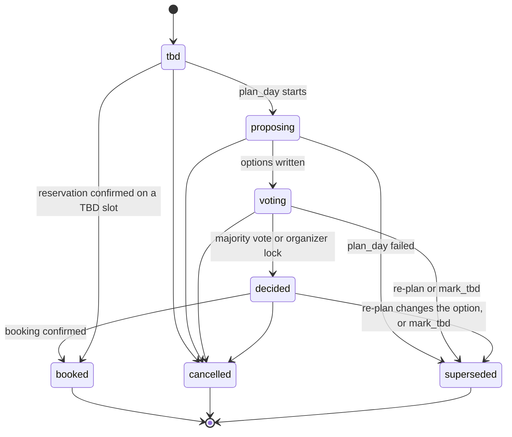

- **Re-planning never moves an item backward.** A decided item whose option changes becomes `superseded`, and a new item for the same slot takes over (`supersedes_item_id` points back to the old one). Time shifts on items that aren't booked just update `starts_at` and `ends_at`; they aren't status changes.
- **Booked items are pinned**, and re-planning plans around them.
- If `plan_day` fails after setting `proposing`, those items move to `superseded`, and replacement items are created in `tbd`, in the same transaction as the error card.

### 4.2 Mandate and holds

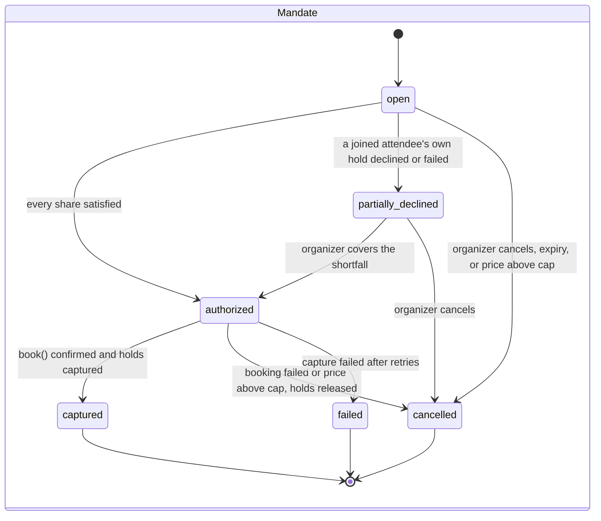

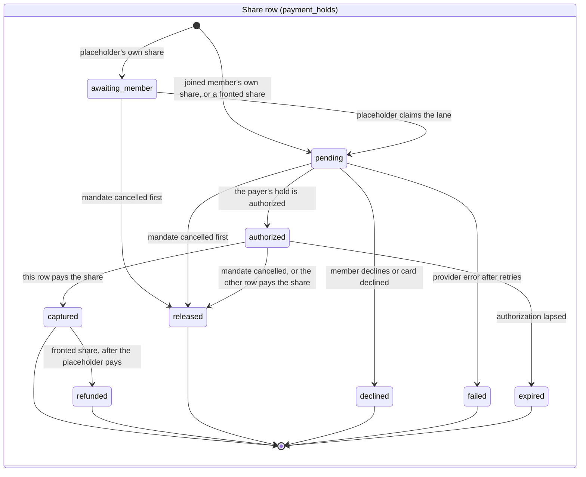

- **Holds and shares.** Each payer has one hold (one PaymentIntent) per mandate. The organizer's hold covers their own share plus each fronted share, so its cap is the sum ($94 on the seeded trip). Each share has an `own` row, and a placeholder's share also has a `fronted` row on the organizer's hold.
- **Satisfied shares.** A share is satisfied when a row that may pay it is `authorized`: the `own` row, or for a placeholder, the `fronted` row. The mandate moves `open → authorized` when every share is satisfied. So the booking can happen before Person 4 joins, and a member who joins late never blocks the group.
- **Finalizing:** exactly one caller wins the conditional update `open → authorized` and runs `finalizeMandate`:
  1. `book()`.
  2. **Precedence: each share is paid by exactly one row.** If the share's `own` row is `authorized`, it pays; otherwise the `fronted` row pays. The row that doesn't pay moves to `released`.
  3. Capture each PaymentIntent once, for the sum of the rows it pays. When Person 4's own hold paid their share, the organizer's hold is partially captured for the organizer's own share only, and Stripe releases the remainder.
  4. `complete_mandate` (§3.4) sets `final_cents`, moves the item to `booked`, and writes the `booking_confirmed` card.
- **After capture.** If a `fronted` row paid Person 4's share and Person 4 later approves, their `own` row goes `pending → authorized → captured` for the same amount. Then the `fronted` row goes `captured → refunded`, and the organizer's PaymentIntent gets a partial refund of that amount. The Stripe idempotency key is `cover-refund:{mandate_id}:{share_member_id}`, and the conditional update `captured → refunded` makes a repeat a no-op. **The refund applies only when the organizer's hold actually paid the share.**
- **Fronting, as the user sees it** ([ADR 0004](adr/0004-consent-as-mandates-with-holds.md)):
  - The organizer's approval card says so: "Approve up to $94, including Person 4's $47 until they join" (§2.1).
  - Until Person 4's own share is captured, it reads "Fronted by the organizer" in their lane (`ShareStatusBadge`) and on the approval card.
- **Every order, on the seeded trip** ($42 shares, $47 caps). A database test pins each row (plan CO-212):

  | Order | Who pays Person 4's share | Organizer's PaymentIntent | Person 4's PaymentIntent | Refund to the organizer |
  | --- | --- | --- | --- | --- |
  | Claims and approves before capture | Person 4's own hold | authorized $94, captured $42, $52 released | captured $42 | none |
  | Claims and approves after capture | the organizer's hold, then Person 4 | authorized $94, captured $84 | captured $42 | $42, once |
  | Never claims, or claims and declines | the organizer's hold | authorized $94, captured $84 | none | none |
- **Price change (Should).** `book()` re-quotes at finalize time. In development, the dev toolbar's price-change trigger changes the mock merchant's price before the last approval:
  - New total within the cap: capture the new amount (`auto_captured`).
  - A drop: capture the lower amount (`auto_captured_lower`).
  - Above the cap: the mandate is cancelled (`price_above_cap`), its holds are released, and a new mandate with `supersedes_mandate_id` asks everyone again (`reapproval_requested`).

### 4.3 Booking

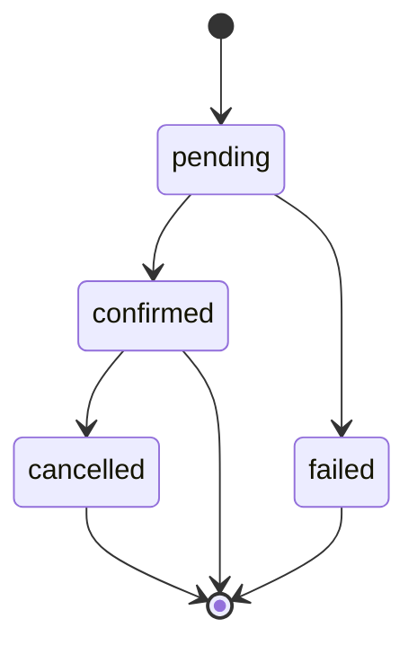

### 4.4 Call

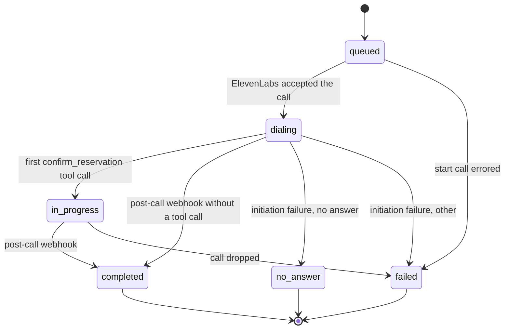

`outcome` is written once, by whichever arrives first: the mid-call tool or the post-call data collection. Later sources only fill `summary`.

### 4.5 Agent run

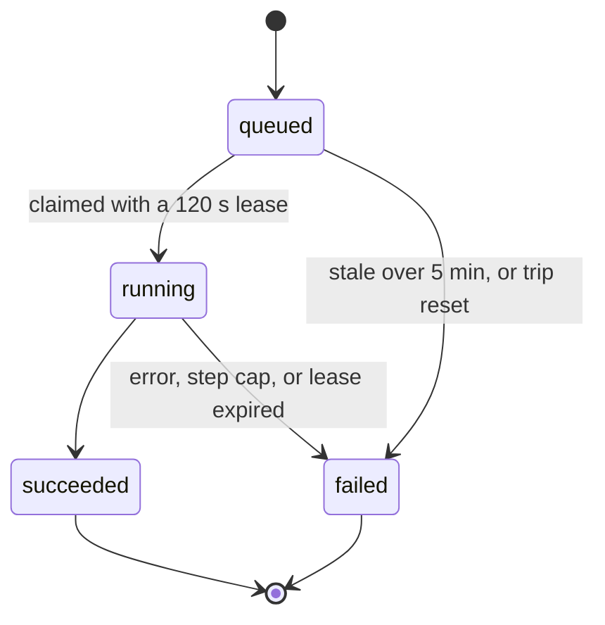

A new run starts `queued`. The runner claims it only when no other run for the trip is `running`, which the partial unique index enforces. When a run finishes, it starts the trip's oldest queued run. A crashed run's expired lease lets the next claimant mark it `failed` first.

---

## 5. Core user flows

These six flows are what the product does. The seeded trip, "Saturday in Atlanta" (§10), is the running example. Each flow is described from the members' side, then as a sequence diagram, where "All members" means every member's open client. `plan.md` tiers its tasks against these flows: a task is Must only if one of them fails without it.

| # | Flow | Starts with | Ends with |
| --- | --- | --- | --- |
| 5.1 | Plan a day | "@agent plan Saturday, $80 each, Person 2's vegetarian, Person 4 joins later." | a plan card, lanes, and a map, the same for every member |
| 5.2 | Vote | a member taps an option | tallies update for everyone; the slot locks at a majority |
| 5.3 | Book with group approval | "@agent book the aquarium." | every share approved, the booking made, and the charges captured |
| 5.4 | Restaurant call | "@agent dinner for 4 at 7." | dinner booked at the confirmed time, and the day re-planned around it |
| 5.5 | Placeholder claims their lane | Person 4 opens their invite link | Person 4 joined and paid, and the organizer refunded if they fronted the share |
| 5.6 | Recap | a member opens a past trip | photos pinned to stops with captions and best shots, and a recap story |

### 5.1 Plan a day

A member mentions @agent with the group's constraints. Every member sees the agent's progress in the status bar, then a plan card: 2–3 scored options per slot, a split-up plan where the group branches and meets again, and bars showing who gains and who gives up on each tradeoff. The lanes view shows each member's lane branching at the split and merging again, and the map shows each member's route; tapping a stop highlights it in both. On the seeded trip, dinner stays a TBD block. The map shows a provisional "Dinner, TBD" pin at the dinner area, with dashed routes merging there, and the lanes show the same stop (§8.3).

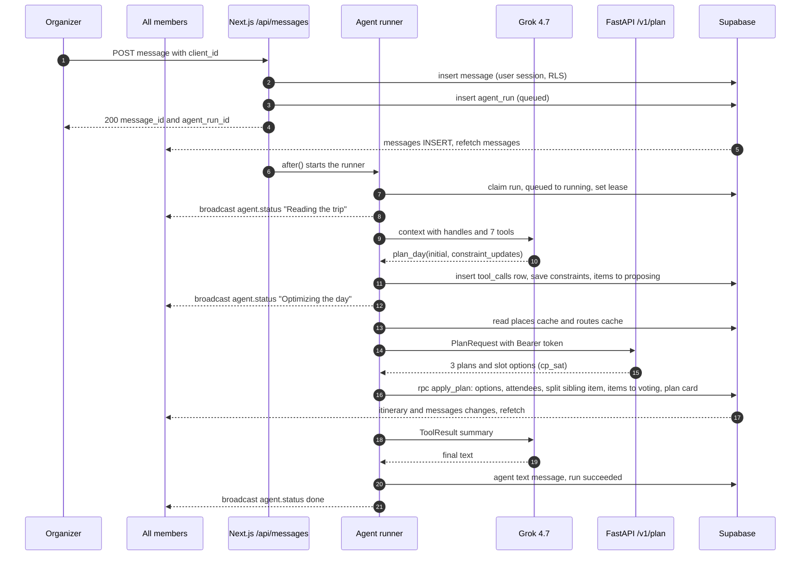

### 5.2 Vote

Members vote on the options for a slot. Tallies update on every member's screen, and the slot locks when one option has votes from more than half of its joined attendees.

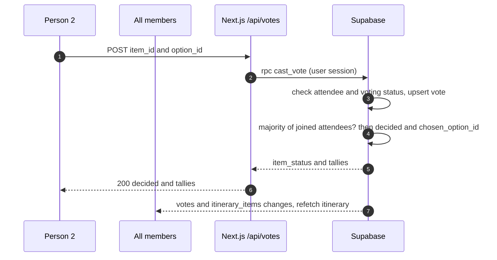

### 5.3 Book with group approval

The organizer asks the agent to book a decided item. Each attending member sees an approval card reading "Approve up to $47". The organizer's card also covers Person 4, who hasn't joined yet: "Approve up to $94, including Person 4's $47 until they join". Once every share is satisfied, the server books and captures. Everyone sees the booked card, and Person 4's lane reads "Fronted by the organizer" (§4.2).

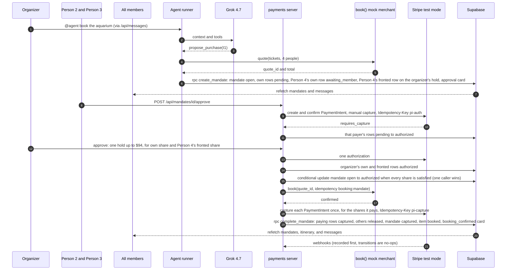

### 5.4 Restaurant call

The organizer asks for dinner. An ElevenLabs voice agent calls the restaurant. The restaurant offers 7:45 instead of 7:00, and the voice agent confirms mid-call through a server tool, so the chat shows the booking while the call is still live. The dinner's provisional pin moves to the restaurant, and its routes turn solid. A follow-up agent run re-plans around the pinned dinner. On the seeded trip, its plan card shows the afternoon moved to 3:00–6:00. The re-plan computes that shift (§2.1); nothing hardcodes it.

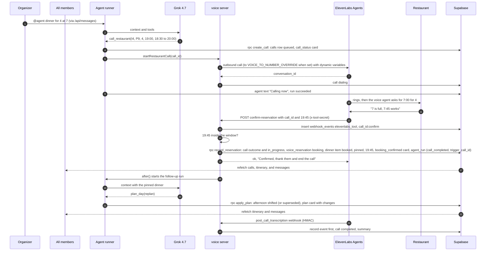

If the offered time is outside the window, the tool returns `ok: false` with "That time doesn't work. Ask for something between 6:30 and 8:00 PM, or thank them and end the call." If the call fails, the call card shows the failure, and the dinner stays a TBD block.

### 5.5 Placeholder claims their lane

Person 4 opens the invite link. They see the trip and the lane already planned for them. Join asks for their email and sends a magic link back to the invite page; there, signed in, Join claims the lane, and one more tap approves their share. In dev mode, Join signs in a fresh claimer through a server-generated link and skips the email ([ADR 0016](adr/0016-magic-link-auth.md)). Everyone sees a member-joined card. If the organizer's hold paid Person 4's share, the organizer is refunded that amount, once, and Person 4's lane changes to "Paid" (§4.2).

```mermaid
sequenceDiagram
    autonumber
    participant P4 as Person 4
    participant All as All members
    participant Page as /invite/token page
    participant API as Next.js /api/invites/claim
    participant Pay as payments server
    participant Stripe as Stripe test mode
    participant DB as Supabase
    P4->>Page: open invite link
    Page->>DB: previewInvite(token), admin client, limited fields
    Page-->>P4: trip, their planned lane, "Join as Person 4"
    P4->>Page: Join with email
    Page->>DB: auth.signInWithOtp(email, next = invite page)
    DB-->>P4: magic link email
    P4->>Page: open link, /auth/confirm verifies it, back on the invite page signed in
    P4->>API: POST token
    API->>DB: rpc claim_invite(token) as Person 4
    DB-->>API: trip_slug and member_id
    API->>Pay: onPlaceholderClaimed(member_id)
    Pay->>Stripe: dev mode only, ensureCustomer and attachTestCard(visa)
    Pay->>DB: Person 4's own rows awaiting_member to pending
    API->>DB: member_joined card
    DB-->>All: refetch members, mandates, and messages
    P4->>Pay: POST /api/mandates/id/approve
    Pay->>Stripe: authorize, then capture (mandate already captured)
    Pay->>DB: Person 4's own row captured
    Pay->>Stripe: partial refund of the organizer's PaymentIntent for Person 4's share, Idempotency-Key cover-refund:mandate:member
    Pay->>DB: fronted row captured to refunded (conditional)
    DB-->>All: refetch mandates; the lane badge changes from "Fronted by the organizer" to "Paid"
```

### 5.6 Recap

A member opens a past trip ("Piedmont Park picnic" in the seed data). The gallery shows photos pinned to the stops by timestamp (GPS when present), with near-duplicates hidden, best shots marked, and captions. The recap tells the trip as a story, from the stops, photos, and chat highlights. If there's no recap yet, Generate creates one; Regenerate rewrites it and keeps the share link.

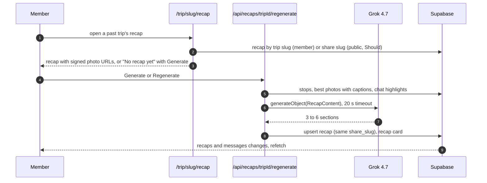

`processPhotos` handles the photos: FastAPI analyzes them, and Grok vision writes captions. For the seeded past trip, it runs once through `pnpm demo:process-photos`, and the results are saved as seed fixtures.

---

## 6. Realtime

Realtime is a doorbell: an event tells the client which data to refetch, and payloads are never treated as state ([ADR 0005](adr/0005-cards-as-message-rows-realtime-refetch.md)).

**Channel.** One channel per trip, `trip:{trip_id}`, opened by `TripRealtimeProvider` with the user's JWT, so RLS applies to every change. It carries:

- `postgres_changes` listeners for each published table, filtered by `trip_id=eq.{trip_id}` (`trips` uses `id=eq.{trip_id}`).
- Broadcast events (below).
- Presence (below).

**Invalidation map** (TanStack Query keys)

| Table change | Query keys refetched |
| --- | --- |
| messages | `['messages', tripId]` |
| itinerary_items, item_options, item_attendees, votes | `['itinerary', tripId]` |
| mandates, payment_holds, price_changes | `['mandates', tripId]` |
| bookings | `['mandates', tripId]`, `['itinerary', tripId]` |
| calls | `['calls', tripId]` |
| trip_members, member_constraints | `['members', tripId]`, `['itinerary', tripId]` |
| trips | `['trip', tripId]` |
| photos | `['photos', tripId]` |
| recaps | `['recap', tripId]` |
| agent_runs, tool_calls | `['agentTrace', tripId]` |

Invalidations for the same key are coalesced over 150 ms, because one agent transaction writes many rows.

**Broadcast events** (Zod schemas in `@agp/shared/events.ts`)

| Event | Payload | Sent by | Client behavior |
| --- | --- | --- | --- |
| `agent.status` | `{ run_id, step: int, state: started \| tool \| done \| failed, label: text, tool?: tool_name }` | runner, over the service connection | updates the status bar (`aria-live="polite"`); `done` and `failed` clear it after 1.5 s |
| `demo.reset` | `{ at: ts }` | `reset:demo` | clears the query cache, re-checks the session, and reloads |

**Presence**: `{ member_id, display_name, lane_color }`. It powers the "who's here" avatars in the header.

**Reconnect and foreground behavior**

| Situation | Behavior |
| --- | --- |
| Channel reports `SUBSCRIBED` after `CHANNEL_ERROR`, `TIMED_OUT`, or `CLOSED` | invalidate every trip key |
| Tab becomes visible after being hidden more than 5 s (iOS pauses sockets when locked) | invalidate every trip key; resubscribe if the channel isn't `SUBSCRIBED` |
| Browser `online` event | same as above |
| Channel not `SUBSCRIBED` for more than 3 s | poll `messages` and `itinerary` every 5 s until it is; show a "Reconnecting…" banner |
| Pull to refresh (mobile) | invalidate every trip key |

Query defaults: `staleTime` 30 s, `refetchOnWindowFocus` true, `retry` 2. Known limit: Realtime can't filter DELETE events by `trip_id`. The app never deletes rows during use, and resets announce themselves with `demo.reset`.

---

## 7. Reliability

### 7.1 Idempotency keys

| Operation | Key | Enforced by |
| --- | --- | --- |
| Send a message | `messages.client_id` (a UUID from the client) | unique; a retry returns the existing row |
| Start a run from a message | `agent_runs.trigger_message_id` | unique |
| Start a follow-up run from a call | `agent_runs.trigger_call_id` | unique |
| Execute a tool | `(run_id, tool_call_id)` | unique on `tool_calls`; a succeeded row returns its stored output |
| Create a mandate | `mandate:{run_id}:{tool_call_id}` | `mandates.idempotency_key` unique; one live mandate per item |
| Authorize a payer's hold | Stripe `Idempotency-Key: pi-auth:{mandate_id}:{payer_member_id}` | Stripe, plus the conditional update pending → authorized on that payer's rows |
| Capture, release | `pi-capture:{mandate_id}:{payer_member_id}`, `pi-release:{mandate_id}:{payer_member_id}` | Stripe, plus the conditional updates |
| Refund a fronted share after the placeholder pays | `cover-refund:{mandate_id}:{share_member_id}` | Stripe, plus the conditional update `captured → refunded` on the `fronted` row |
| Book | `booking:{mandate_id}` or `booking:{call_id}` | `bookings.idempotency_key` unique |
| Start a call | `call:{run_id}:{tool_call_id}` | unique; one active call per item; never retried |
| Webhooks | `(provider, event_id)` | `webhook_events` primary key |
| Mid-call confirmation | `elevenlabs_tool` + `{call_id}:confirm` | `webhook_events`, and `calls.outcome` is written once |

### 7.2 Webhooks and tool callbacks

1. Read the raw body with `await request.text()` before parsing anything.
2. Verify the signature:
   - Stripe: `stripe.webhooks.constructEvent(raw, header, STRIPE_WEBHOOK_SECRET)`.
   - ElevenLabs: the post-call HMAC, rejecting timestamps older than 30 min.
   - The voice tool: a timing-safe comparison of `x-tool-secret`.

   A failed check returns 400 and records nothing.
3. **Record first:** `insert into webhook_events … on conflict do nothing`. If the row already exists:
   - `processed` or `ignored`: return 200 without doing anything.
   - `received` or `failed`, last touched more than 30 s ago: increment `attempts` and process again.
   - `received`, touched within 30 s: return 200, because the first attempt is still running.
4. Process with conditional status updates (§4).

   **Stripe events only confirm share-row statuses.** They never book, capture, or refund, so the synchronous path and the webhook path can run in any order and end in the same state:
   - `payment_intent.amount_capturable_updated`: that payer's `pending` rows move to `authorized`.
   - `payment_intent.succeeded`: that PaymentIntent's rows with `pays_share = true` move to `captured`, and those with `false` move to `released`.
   - `charge.refunded`: the `fronted` row named in the refund's `mandate_id` and `share_member_id` metadata moves `captured → refunded`.
   - `payment_intent.canceled` and `payment_intent.payment_failed`: that payer's open rows move to `released` or `failed`.
5. Mark the event `processed` or `ignored`. On a transient failure, mark it `failed` and return 500 so the provider retries.

Signing secrets are per environment. `stripe listen` prints one secret for local forwarding, and the dashboard endpoint has another for the deployed URL. Each goes in that environment's `STRIPE_WEBHOOK_SECRET`.

### 7.3 Errors

- `AppError` carries `{ code, message, retryable, cause }`.
- Tools turn it into a `ToolError`, and routes turn it into the HTTP mapping in §2.4.
- Every caught error goes to Sentry, tagged with `trip_id`, `run_id`, `tool`, and `provider`.
- **Users always see something:** a failed tool or run writes an `error` card. It has a "Try again" button when the error is retryable; the button re-sends the triggering message with a new `client_id`.

### 7.4 Timeouts, retries, fallbacks

`withPolicy({ timeoutMs, retries, backoffMs: 400 × 2^n, retryOn: [429, 5xx, network] })` wraps every external call.

| Dependency | Timeout | Retries | Fallback |
| --- | --- | --- | --- |
| Grok, per agent step | 25 s (90 s per run) | 1 | an error card with Try again. `LLM_PROVIDER=google` switches to Gemini. |
| Grok vision, recap | 20 s | 1 | keep the previous recap; show a toast |
| FastAPI `/v1/plan` | 8 s | 1 | an error card with Try again. Inside FastAPI, enumeration covers a CP-SAT failure (§2.2). |
| FastAPI `/v1/photos/analyze` | 20 s | 0 | offline job; retry by hand |
| Stripe | 10 s | 2 (SDK `maxNetworkRetries`, same idempotency key) | the hold becomes `failed`; the card shows "Try again" |
| ElevenLabs start call | 10 s | 0 | the call card shows Failed, and the dinner stays TBD |
| Google Places | 5 s | 1 | the places cache |
| OpenRouteService | 5 s | 1 | a straight-line leg, drawn without a travel time |
| Supabase | SDK defaults | 0 | an error card or toast |

### 7.5 Recorded agent runs (development and tests)

Recordings let tests, CI, and offline development run the agent without a model. They are never a runtime fallback.

- **Recording:** with `AGENT_RECORD=1`, a real run writes `{ key, steps: [{ toolName, input }], finalText }` to `web/scripts/demo/fixtures/agent-recordings/<file>.json`. The file name is the key with every character outside `a-z0-9_` replaced by `-`, because Windows can't store `:` in a file name: `call_completed-dinner.json`.
- **Keys:**
  - For a mention, the key is the prompt normalized: lowercase, `@agent` removed, punctuation stripped, whitespace collapsed.
  - For a follow-up run, it's `call_completed:<item slot_key>`.
- **Replay:**
  - Runs only when `LLM_PROVIDER=mock`.
  - The mock LLM returns the recorded tool calls one by one, with 400–900 ms delays, and every tool handler runs for real, so database state, the optimizer, and the cards are real.
  - The run is marked `replayed = true`.
- **Handles:** recorded inputs use handles, which are stable for the seeded state (§2.1).
- **Scope:** one recording per prompt that the e2e tests send (plan, book, and dinner), plus the call follow-up.

---

## 8. Frontend

### 8.1 Routes

| Route | View | Notes |
| --- | --- | --- |
| `/` | static page, then redirect | links nowhere until `/trips` and `/login` exist; then `/trips` if signed in, otherwise `/login` (FE-202) |
| `/login` | magic-link sign-in, plus `DemoLoginPicker` in dev mode | members get an email with a sign-in link; in dev mode, the picker also lists the seeded users and signs in through a server-generated link ([ADR 0016](adr/0016-magic-link-auth.md)) |
| `/auth/confirm` | route handler | verifies the magic link's `token_hash`, sets the session cookie, and redirects to `next` |
| `/trips` | trip list | active trips first, then past |
| `/trip/[slug]` | Chat | default tab |
| `/trip/[slug]/plan` | Lanes | `?member=<id>` or `?member=me` filters to one lane ("My plan") |
| `/trip/[slug]/map` | Map | `?stop=<item_id>` selects a stop |
| `/trip/[slug]/gallery` | Gallery | |
| `/trip/[slug]/recap` | Recap | the slug may be a trip slug (members) or a recap share slug (public) |
| `/invite/[token]` | Invite claim | works signed out |

Non-members opening `/trip/[slug]` see a "Request to join" screen with the trip title only. Selection is shared through the `?stop=` search parameter, so on desktop the lanes and the map highlight each other without a state library.

### 8.2 Design tokens

Tokens are CSS variables in `globals.css`, exposed to Tailwind 4 with `@theme`. There are light and dark sets; dark follows `prefers-color-scheme`.

| Group | Tokens |
| --- | --- |
| Color | `--bg`, `--surface`, `--surface-2`, `--border`, `--text`, `--text-muted`, `--primary`, `--primary-contrast`, `--success`, `--warning`, `--danger`, `--info`, `--focus` |
| Lanes (Okabe-Ito, color-blind safe) | `--lane-1` #0072B2, `--lane-2` #E69F00, `--lane-3` #009E73, `--lane-4` #CC79A7, `--lane-5` #56B4E9, `--lane-6` #D55E00 |
| Type | Geist Sans and Geist Mono (bundled with Next.js); sizes 12 / 14 / 16 / 18 / 22 / 28; line height 1.4 for body text |
| Space | 4-point scale: 4, 8, 12, 16, 24, 32, 48 |
| Radius | 8 (controls), 12 (inputs), 16 (cards), 999 (pills) |
| Elevation | `--shadow-sm`, `--shadow-md` |
| Motion | 150 ms and 250 ms, ease-out; `prefers-reduced-motion` turns off movement but keeps fades |
| Touch | minimum target 44 × 44 px |

Lane colors never carry meaning alone. Every lane also shows the member's initials.

### 8.3 Component hierarchy

```text
RootLayout
└── Providers (QueryClientProvider, SupabaseProvider)
    └── TripLayout (/trip/[slug])
        ├── TripHeader: title, date, PresenceAvatars, AgentStatusBar (aria-live)
        ├── TripRealtimeProvider (channel, invalidation, reconnect)
        ├── phone:  <Tab content> + BottomTabs (Chat · Plan · Map · Gallery)
        └── desktop: SplitView [ChatView | PlanView | MapView] (≥ 1024 px)

ChatView
├── MessageList (virtualized after 200 messages)
│   └── MessageItem
│       ├── TextBubble (member, agent, or system)
│       └── CardRenderer → CardFrame → <card body from lib/tools/cards.tsx>
└── Composer: textarea, @agent chip, mention autocomplete, send button

PlanView
├── PersonFilter (All · Me · member chips)
└── LanesView
    └── SlotRow (one per slot_key, in time order)
        ├── GroupBlock × 1 (merged) or × 2 (split), with attendee avatars
        │   └── ItemBlock → ShareStatusBadge (from payments; "Fronted by the organizer", "Paid") and OptionList → OptionRow (score bar, tally, VoteButton)
        └── LaneConnectors (SVG lines per member color, showing branches and merges between rows)

MapView → TripMap (mapcn Map)
├── StopMarker (numbered, the selected one enlarged; a provisional pin for a TBD stop)
├── RouteLine per member (lane color; solid to a confirmed stop, dashed to a provisional one)
└── TravelTimeLabel ("12 min walk", "8 min drive"; none on a provisional leg)
```

**Stops are derived once, for both views.** `lib/trip-view` defines `TripView`, the one shape both the lanes and the map render: lanes, stops, legs (routes), branch and merge points, and provisional pins. `buildTripView(rows)` computes it from itinerary rows, and `useTripView(tripId)` serves it under the `['itinerary', tripId]` query key. Neither view computes a stop or a leg itself, so they always agree:

| Item | Stop | Map | Lanes |
| --- | --- | --- | --- |
| Decided or booked | the chosen place | numbered pin; solid legs from the previous stops | the place's name |
| Voting | the rank-1 option's place, until the vote locks | numbered pin; solid legs | the options, with the rank-1 option first |
| TBD, with an `area` (§3.2) | provisional, at the area | a "Dinner, TBD" pin at the area; dashed straight legs merging there, with no routing call and no travel time | "Dinner, TBD · Midtown", marked provisional |
| TBD, with no `area` | none | no pin; legs end at the previous stop | "Dinner, TBD" |

When the restaurant call books dinner, `buildTripView` returns the restaurant as its stop, so the pin moves there and its legs turn solid in the same refetch. Walking versus driving is shown in the travel-time label, not the line style, so dashes always mean "not booked yet". This departs from plan §4, which dashed walking legs (§11.3, item 2).

```text
GalleryView → StopSection → PhotoGrid → PhotoTile (best-shot badge, caption)
RecapView → RecapStory → RecapSection
InviteClaimView → LanePreview → JoinButton
DevToolbar (dev mode only): Reset · Price change (Should)
```

### 8.4 The shared card frame

`CardFrame` props:

| Prop | Type | Notes |
| --- | --- | --- |
| icon | component | |
| title | text | |
| subtitle | text | optional |
| status | `{ tone: neutral \| info \| success \| warning \| danger, label }` | a status pill |
| actor | `agent` \| `system` | shown as "Agent" or "Trip" |
| timestamp | ts | |
| state | `ready` \| `loading` \| `error` \| `unavailable` | |
| actions | `[{ label, onPress, variant, pending, disabled }]` | |
| children | the card body | |

- **Semantics:** the frame renders `<article aria-labelledby>`. Actions are real `<button>`s with a spinner and `aria-busy` while pending.
- **States:** `unavailable` means the referenced row no longer exists, for example after a reset; it reads "This card is out of date." `error` shows the message and, if retryable, "Try again".

Card catalog:

| card_type | Owner | Live data | Actions |
| --- | --- | --- | --- |
| place_list | AI | none (snapshot) | "Plan with these" (pre-fills the composer) |
| plan | AI | `itinerary` (tallies, statuses) | vote per option; "See on map" |
| itinerary_change | AI | `itinerary` | none |
| summary | AI | none | none |
| approval | VO (renderer; CO writes the mandate) | `mandates` | "Approve up to $X" (the organizer's label includes fronted shares, §2.1) · Decline (Should); organizer: Cover shortfall (Should) |
| call_status | VO | `calls` | none |
| recap | AI | `recap` | Open · Copy link |
| booking_confirmed | VO (renderer; CO writes the booking) | `mandates` | none |
| price_change | CO | `mandates` | Approve again (above the cap) |
| member_joined | VO | `members` | none |
| error | FE | none | Try again (if retryable) |

### 8.5 Loading, error, empty, and interaction states

| View | Loading | Empty | Error |
| --- | --- | --- | --- |
| Chat | 3 message skeletons | "Say hi, or type @agent to start planning." | inline banner with Retry; the composer stays usable |
| Plan | slot-row skeletons | "No plan yet. Ask @agent to plan the day." | banner with Retry |
| Map | map placeholder; routes fade in | "Stops appear here once the plan has places." | "Map unavailable" with a list of stops as a fallback |
| Gallery | tile skeletons | "No photos yet." (upload is Should) | banner with Retry |
| Recap | section skeletons | "No recap yet." plus Generate | keep the old recap; toast |
| Invite | preview skeleton | "This invite was already used." | "Invite not found." |
| Cards | skeleton body while live data loads | none | CardFrame `error` |

- **Interaction states** for every control: hover (surface-2), active (scale 0.98), focus-visible (a 2 px `--focus` ring offset by 2 px), disabled (50% opacity, `aria-disabled`, no pointer events), pending (spinner, label kept).
- **Vote and approve buttons** use `aria-pressed` and `aria-busy`.

### 8.6 Layouts

- **Phone (the default):**
  - `100dvh`, with a viewport meta that includes `interactive-widget=resizes-content`, so the composer sits above the keyboard.
  - A 56 px header, and bottom tabs 64 px tall plus `env(safe-area-inset-bottom)`.
  - Cards are full width minus a 12 px gutter; the map is full-bleed.
  - One scroll container per tab.
- **Desktop (≥ 1024 px):**
  - A three-column grid: chat 380 px, lanes flexible, map 40%.
  - In dev mode, the dev toolbar sits at the bottom right.

---

## 9. Environment variables

`web/src/lib/env/server.ts` (starts with `import 'server-only'`) and `client.ts` validate the environment with Zod at startup. A real provider's keys are required only when that provider is selected. A missing variable fails the boot with a list of what's missing. `.env.example` files hold placeholders only.

### 9.1 web (Vercel and local)

| Variable | Scope | Required | Notes |
| --- | --- | --- | --- |
| `NEXT_PUBLIC_APP_URL` | public | yes | used to build invite links |
| `NEXT_PUBLIC_SUPABASE_URL` | public | yes | |
| `NEXT_PUBLIC_SUPABASE_PUBLISHABLE_KEY` | public | yes | or the legacy anon key |
| `SUPABASE_SECRET_KEY` | server | yes | or the legacy service role key; only the admin client uses it |
| `NEXT_PUBLIC_DEMO_MODE` | public | yes | `true` \| `false`; `true` is dev mode (§9.4). Never true in production. |
| `DEMO_ADMIN_TOKEN` | server | in dev mode | the `x-demo-token` value for `/api/demo/*` |
| `LLM_PROVIDER` | server | yes | `xai` \| `google` \| `mock` |
| `AGENT_MODEL` | server | yes | default `grok-4.7` |
| `VISION_MODEL` | server | yes | default `grok-4.7` |
| `AGENT_RECORD` | server | no | `1` records agent runs to fixtures |
| `XAI_API_KEY` | server | when `xai` | |
| `GOOGLE_GENERATIVE_AI_API_KEY` | server | when `google` | |
| `OPTIMIZER_URL` | server | yes | Railway URL, or `http://localhost:8000` |
| `OPTIMIZER_TOKEN` | server | yes | shared with the optimizer |
| `PAYMENTS_PROVIDER` | server | yes | `real` \| `mock` |
| `STRIPE_SECRET_KEY` | server | when real | test mode key only (`sk_test_`); boot fails on a live key |
| `STRIPE_WEBHOOK_SECRET` | server | when real | one per environment |
| `VOICE_PROVIDER` | server | yes | `real` \| `mock` |
| `ELEVENLABS_API_KEY`, `ELEVENLABS_AGENT_ID`, `ELEVENLABS_PHONE_NUMBER_ID` | server | when real | |
| `ELEVENLABS_WEBHOOK_SECRET` | server | when real | post-call HMAC |
| `ELEVENLABS_TOOL_SECRET` | server | when real | also configured on the ElevenLabs server tool |
| `VOICE_MOCK_SCENARIO` | server | no | with `VOICE_PROVIDER=mock`: `accept` (default), `outside-window`, `tool-never-fires`, `duplicate-tool`, `webhook-first`, or `no-answer` |
| `VOICE_TO_NUMBER_OVERRIDE` | server | in dev mode | E.164; when set, every call goes here instead of the venue. The real number lives only in `web/.env.local` and the hosting env. `.env.example` holds the fictional placeholder `+15555550100`, and the real number never appears in docs, fixtures, or commits. |
| `PLACES_PROVIDER` | server | yes | `real` \| `mock` |
| `GOOGLE_PLACES_API_KEY` | server | when real | |
| `ROUTING_PROVIDER` | server | yes | `real` \| `mock` |
| `ORS_API_KEY` | server | when real | |
| `STAYS_PROVIDER` | server | yes | `real` \| `mock` (default `mock`) |
| `DUFFEL_ACCESS_TOKEN` | server | when real | test token (`duffel_test_`) |
| `NEXT_PUBLIC_SENTRY_DSN`, `SENTRY_DSN` | public, server | no | |
| `SENTRY_AUTH_TOKEN` | build | no | source maps |

### 9.2 optimizer (Railway and local)

| Variable | Required | Notes |
| --- | --- | --- |
| `OPTIMIZER_TOKEN` | yes | the bearer token |
| `PORT` | yes | Railway sets it |
| `ALLOWED_PHOTO_HOSTS` | yes | comma-separated; the Supabase storage host |
| `SOLVER_TIME_LIMIT_MS` | no | default 2000 |
| `SENTRY_DSN` | no | |
| `LOG_LEVEL` | no | default `info` |

### 9.3 scripts (`web/scripts/demo`)

These use the web server variables, plus `DEMO_SEED_SECRET` (salts Person 4's invite token) and `DEMO_EMAIL_DOMAIN` (default `demo.agp.test`).

### 9.4 What the flags switch

| Flag | Value | Effect |
| --- | --- | --- |
| `NEXT_PUBLIC_DEMO_MODE` | `true` (dev mode) | seeded-user login picker; dev toolbar; test card attached automatically for claimers; `VOICE_TO_NUMBER_OVERRIDE` required; `/api/demo/*` enabled |
| `LLM_PROVIDER` | `mock` | recorded tool decisions and fixture captions; no Grok calls |
| `PAYMENTS_PROVIDER` | `mock` | no Stripe calls; holds authorize and capture at once; `pm_mock_declined` declines |
| `VOICE_PROVIDER` | `mock` | no phone call; the mock plays `VOICE_MOCK_SCENARIO` against the real tool route and the post-call webhook (by default, a confirmation at 19:45 after 4 s, then a post-call event after 8 s) |
| `PLACES_PROVIDER` | `mock` | fixture venues only |
| `ROUTING_PROVIDER` | `mock` | straight-line routes and times |
| `STAYS_PROVIDER` | `mock` | fixture hotel quote and booking |

Profiles: **build** (every provider mock except Supabase), **integration** (switch providers to real one at a time; plan Milestone 3), and **full** (every provider real).

---

## 10. Seed data (development and testing)

Seed data gives development, tests, and CI a known trip to run every core flow against (§5). It's tooling: the product never references seeded IDs, and seeded trips and users are ordinary records.

### 10.1 Cast

| Member | Role | Status at seed | Constraints (budget; dietary; interests) |
| --- | --- | --- | --- |
| Person 1 | organizer | joined | $80; none; art, history, food |
| Person 2 | member | joined | $80; vegetarian; outdoors, animals |
| Person 3 | member | joined | $80; none; animals, outdoors, shopping |
| Person 4 | member | **placeholder** (has an invite token) | $80; none; art, museums |

Display names are exactly `Person 1` through `Person 4`, everywhere: seed data, prompts, recordings, card copy, and diagrams. The repo contains no personal names for the cast. In dev mode, seeded users sign in through the picker (`person1@demo.agp.test` through `person3@demo.agp.test`), which verifies a server-generated magic link; they have no passwords. Person 4 joins through the invite link, by magic link.

### 10.2 Trips

**"Saturday in Atlanta"** (`status = planning`). The date is the next Saturday after seeding, in America/New_York.

| slot_key | Label | Time | Category | together | Seed status | Area |
| --- | --- | --- | --- | --- | --- | --- |
| morning | Morning | 10:00–12:30 | activity | yes | tbd | — |
| lunch | Lunch | 12:45–13:45 | food | yes | tbd | — |
| afternoon | Afternoon | 14:15–17:15 | activity | no | tbd | — |
| dinner | Dinner | 19:00–20:30 | food | yes | tbd (filled by the restaurant call) | Midtown, with the area's center as `area_lat` and `area_lng` |

- **Places cache:** about 12 Atlanta venues in `places` (`provider = seed`), with tags, dietary tags, hours, and prices. The planner inputs live in one fixture, `web/scripts/demo/fixtures/saturday-trip.json`, which both `seed.ts` and pytest read. The fixture prices and tags are tuned so the optimizer's top plan is:
  - Morning: everyone at the aquarium.
  - Lunch: everyone at a vegetarian-friendly spot.
  - Afternoon: split. Person 1 and Person 4 at the High Museum; Person 2 and Person 3 at Piedmont Park.
  - Dinner isn't planned. It's the fourth slot, so it stays a TBD block for everyone until the restaurant call books it (§2.1 `plan_day`). Until then, the map shows a provisional "Dinner, TBD" pin in Midtown with dashed routes merging there, and the lanes show the same stop (§8.3).

  `test_seeded_trip_plan` pins the plan above, so fixture changes can't silently change it. `test_seeded_replan` checks the restaurant call's re-plan. With the aquarium booked and dinner confirmed at 19:45, the re-plan's computed output moves the afternoon to 15:00–18:00, and no shifted item falls outside its venue's opening hours. The shift is computed from the confirmed time; no code or hand-written fixture contains it.
- **Aquarium tickets:** sold by the mock merchant at $42 per person. With the 110% cap, each share shows "Approve up to $47". Person 1's card shows "Approve up to $94, including Person 4's $47 until they join".
- **Restaurant:** one restaurant in the cache is the call target. Its fixture `phone` is a fictional 555-01xx number, and in dev mode calls go to `VOICE_TO_NUMBER_OVERRIDE` (§9.1).
- **Routes:** geometry for every pair of consecutive stops in the top 3 plans, walking and driving, can be cached into a fixture so seeding makes no routing calls.

**The past trip, "Piedmont Park picnic"** (`status = completed`, last month):

- 3 stops.
- 24 photos (3 near-duplicates), with taken-at times and GPS on most.
- Captions and best shots, precomputed into fixtures by the photo pipeline. The recap comes from Generate (§5.6), or from a fixture if one was saved.

**Stripe:** seeded customers for Person 1, Person 2, and Person 3, each with `pm_card_visa` attached and metadata `demo=true`, `seed_batch=demo`.

**Agent recordings:** one per prompt that the e2e tests send, plus `call_completed:dinner` (§7.5).

### 10.3 Tagging and IDs

- `seed_batch = 'demo'` on every seeded row, on Stripe metadata, and on seeded users' `user_metadata`. Storage objects live under `demo/`.
- **Deterministic IDs:** seeded rows use UUIDv5 values derived from `{batch}:{fixture name}`, so `seed:demo` upserts the same rows every time.
- **Batches:** `seed:demo` and `reset:demo` take `--batch <name>` (default `demo`). Emails in a non-demo batch carry the batch name (`person1.dev-fe@demo.agp.test`). Each engineer works in their own batch, and each e2e run uses `e2e-<random>`, so nobody's reset wipes someone else's data on the shared Supabase project. Places and routes are a global cache and are shared.
- **Stages:** `--stage planned|voted|booked` fast-forwards the Saturday trip for development and e2e. `planned` applies the fixture plan through `applyPlan`. `voted` adds two votes that lock the morning. `booked` runs the aquarium mandate through approvals and finalizing on mock payments. Each stage lives in its own file under `scripts/demo/stages/`, owned by the workstream whose code it calls.

### 10.4 `seed:demo` (safe to re-run)

1. Upsert auth users (admin API) and their profiles.
2. Ensure Stripe customers and test cards. Skipped when `PAYMENTS_PROVIDER=mock`.
3. Upsert places, and routes from the routes fixture if it exists.
4. Upsert both trips, their members, constraints, and items, including dinner's area. Person 4 is a placeholder whose invite token is derived from `DEMO_SEED_SECRET` and the batch. It's the same after every reset, so Person 4's saved invite link keeps working, but it can't be guessed from the repo.
5. Past trip: upload the photos to `demo/` if they're missing, then insert the photo rows, and the recap if a fixture exists.
6. Run the requested `--stage`, if any.
7. Print Person 4's invite link and the trip URLs.

### 10.5 `reset:demo` (under 30 seconds)

1. Broadcast `demo.reset` on each of the batch's trip channels.
2. Delete trips where `seed_batch` is the batch. Everything trip-scoped cascades: members, items, options, votes, mandates, holds, bookings, calls, messages, runs, photos rows, and recaps.
3. Delete auth users whose profile has the batch's `seed_batch` and who aren't seeded fixture users. These are the claimers, like the user who claimed Person 4's lane. That browser's session becomes invalid, and it returns to the saved invite link, which still works.
4. Run `seed:demo` steps 4–7.

   Seeded users, places, routes, Stripe customers, and storage objects are kept, so seeded users stay signed in.

`reset:demo --all` also deletes the seeded users, places, routes, and storage objects. Stripe objects stay; they are harmless in test mode. Stale sessions: if any Supabase call returns an invalid-user or JWT error, the client signs out and returns to `/login`, or to the last invite link, which is saved in local storage.

---

## 11. Deviations and interpretations

These are the places where this design departs from, or chooses between readings of, the plan (Sep 23) or the Phase 1 to 4 instructions.

**Cast names.** The master plan uses personal names; this repo uses labels. Jordan → Person 1 (organizer), Ben → Person 2 (vegetarian), Cara → Person 3, Ana → Person 4 (placeholder who joins later). The docx itself is unchanged.

### 11.1 Resolved at the Phase 2 review (2026-09-23)

| # | Topic | Ruling | ADR |
| --- | --- | --- | --- |
| 1 | Optimizer fallback. The Phase 2 request asked for "CP-SAT with an LLM + scoring fallback"; plan §5 says exhaustive enumeration with the same scoring function. | Follow the plan: enumeration with the same `scoring.py`. The LLM only writes the explanation. (The Phase 3 review made the mock optimizer a test double only; §11.2.) | [0007](adr/0007-cp-sat-with-enumeration-fallback.md) |
| 2 | Re-planning. Plan §11 says "Re-planning moves decided back to proposing." | Approved as designed: a changed item becomes `superseded`, and a replacement item takes the slot. `mark_tbd` works the same way (§4.1). | [0015](adr/0015-forward-only-statuses.md) |
| 3 | Capturing before a placeholder joins. Plan §3 says capture "only when everyone has approved"; the booking flow (§5.3) captures before Person 4 joins. | Approved: the organizer fronts Person 4's share, with four requirements. (a) Person 1's approval card says so: "Approve up to $X, including Person 4's $Y until they join." (b) When Person 4 approves and their charge captures, Person 1 is refunded once, keyed on the mandate and Person 4's member ID. (c) If Person 4 never joins, Person 1's payment stands and nothing is refunded. (d) Person 4's lane shows their share as "Fronted by the organizer" until they pay. The Phase 3 review added a precedence rule (§11.3, item 4). See §2.1, §4.2, and §7.1. | [0004](adr/0004-consent-as-mandates-with-holds.md) |
| 4 | Photo processing. Plan §7 puts it in FastAPI. | Approved: captions and aesthetic scores run in Next.js through the LLM adapter; hashing, deduplication, stop matching, and technical scores run in FastAPI. | [0012](adr/0012-stateless-optimizer.md) |
| 5 | Provider flags. Plan §8 lists five flags as "real or mock". | Approved: `LLM_PROVIDER` takes `xai \| google \| mock`, and `PLACES_PROVIDER` is added. | [0009](adr/0009-mock-first-provider-adapters.md) |
| 6 | `@stripe/stripe-js` and `@stripe/react-stripe-js`, listed in plan §7. | Approved: dropped from the first release and removed from `planning/stack.md`. Holds are confirmed on the server with saved test cards. | [0001](adr/0001-stack.md), [0004](adr/0004-consent-as-mandates-with-holds.md) |
| 7 | Comments and trip creation. The plan has no comments table and never lists trip creation. | Approved: item comments are `messages` rows with `item_id` set (Should). Trip creation is Should; a minimal create-trip flow is in the plan (`/api/trips` §2.4, `create_trip` §3.4). | none (design §3.2, §3.4) |
| 8 | Folder list and tools as folders (from the Phase 4 instructions). | Approved: features `voice`, `invite`, and `demo` sit next to the seven listed, and each tool folder holds a server `tool.ts` and a client `card.tsx`. | [0008](adr/0008-pnpm-monorepo-shared-contracts.md) |
| 9 | Skills folder. | `skills/` inside the project holds the canonical 10-skill set. Revised Sep 25: `skills/` is gitignored, and `planning/` is tracked except `adr/` and `master-plan.docx`. | none |
| 10 | Cast names. | Person 1–4 labels in every repo file (see "Cast names" above). | none |
| 11 | Restaurant phone for testing the call. | Only in `web/.env.local` and the hosting env, as `VOICE_TO_NUMBER_OVERRIDE`. `.env.example` holds `+15555550100`, and the real number never appears in docs (§9.1). | [0006](adr/0006-voice-confirmation-mid-call-tool.md) |

### 11.2 Changes made at the Phase 3 review (2026-09-23)

The review asked for these directly:

- **Planning docs moved** into `planning/`, which is gitignored. Tracked files never link into it.
- **Event logistics removed.** Judging, tracks, sponsors, the timeline, rehearsals, hardware, and the demo video are gone. [ADR 0002](adr/0002-pre-event-work-policy.md) is Withdrawn, so the planning docs may include code. The demo script is now the core user flows (§5).
- **Mocks, seed data, and replay are development and testing tooling**, never runtime fallbacks.

Applying those required a few interpretations. Each can be reversed:

- **No runtime fallbacks.** Automatic replay in demo mode, the mock optimizer when FastAPI is unreachable, the call card's "Inject outcome" button, and the warm-up action are removed. A failure now shows an error card with Try again (§7.4).
- **Email sign-in is Must.** Members sign in with an email one-time code; the seeded-user picker is dev-mode tooling ([ADR 0013](adr/0013-demo-auth-picker-and-anonymous-claim.md)). Under the new tiering, every flow fails without a real sign-in.
- **Desktop layout, not a big screen.** The three-column layout stays as the desktop layout. Its "reading at a distance" font step is gone.
**Resolved at the Phase 3 follow-up (2026-09-23):**

- **4.2, scoring interface first: resolved.** The user confirmed the reading. `score_table.py` is the contract between scoring and the engines (§1, §2.2), and AI-202 builds it with hand-checked fixtures. Scoring, both engines, and the request builder then proceed in parallel. The engines stay with AI.
- **Ownership:** the booking confirmed card and the approval card, with `useMandates`, move from CO to VO (VO-213, VO-214). The files stay in the booking and payments features.
- **4.2b, trip view model first.** `lib/trip-view` defines `TripView`, the one shape the lanes and the map render (§8.3), with hand-checked fixtures that include the provisional dinner pin. The lanes, map, and data tracks run in parallel from it. It replaces `useItinerary` and `stopFor`. The map track could move to VO without file collisions except FE-212, but VO's load argues against it, so it stays with FE.
- **4.3, concurrency.** The Stripe webhook route is Must, and part of the approve, finalize, and fronting tasks. Share rows gain `pays_share`, and Stripe events only confirm row statuses (§7.2). The parallel-approval, duplicate-webhook, and out-of-order-webhook suites run on mocks and on Stripe test mode.
- **4.4, mock voice.** The mock provider plays whole calls, the mid-call tool and the signed post-call webhook, against the real routes (`VOICE_MOCK_SCENARIO`, §9.1). It's its own Must task, before the switch to ElevenLabs.

### 11.3 Resolved at the Phase 3 review (2026-09-23)

These are the gaps that writing the plan exposed, each with its ruling. The task IDs are in `plan.md`.

1. **Write functions are Postgres functions over RPC: yes** (§3.4; CO-104, CO-205, CO-207, CO-210, VO-205, AI-402, FE-203, VO-209). Every function checks trip membership itself, since it can't rely on RLS. Every `security definer` function pins `search_path`. Every function has an automated test that rejects a non-member call, and a schema-wide test catches any unpinned `search_path`.
2. **Dinner stays a TBD block, with the merge point visible: yes** (§3.2, §8.3, §10.2; CO-101, VO-105, FE-211, FE-218).
   - Until the call books the restaurant, the map shows a provisional "Dinner, TBD" pin at the dinner area (`itinerary_items.area_*`), with dashed routes merging there.
   - After the booking, the pin moves to the restaurant, and the routes turn solid.
   - The lanes and the map render one view model, `TripView` (`lib/trip-view`), so they always agree.
   - Walking versus driving moves from the line style to the travel-time label, a departure from plan §4.
   - The rest of the original finding stands: `plan_day` plans the earliest 3 open slots, and a PlanRequest carries pinned neighbors (1–5 slots, at most 3 unpinned).
3. **Afternoon shift to 3:00–6:00: yes, as the computed output of the re-plan on seed data** (§2.1, §10.2; AI-207, AI-210). `test_seeded_replan` asserts it, and it also asserts that no shifted item falls outside its venue's opening hours. The rule is: when a pinned item moves by Δ, the unbooked slot right before it moves by Δ. No code or hand-written fixture contains the shifted times.
4. **Person 4 claiming early: yes, with an explicit precedence rule** (§4.2, §3.2; [ADR 0004](adr/0004-consent-as-mandates-with-holds.md); CO-207, CO-209, CO-210, CO-212).
   - At finalize, each share is paid by exactly one hold. If Person 4's own hold is authorized, it pays their share.
   - Person 1's hold is then partially captured for Person 1's own share only, and the remainder is released.
   - The fronted-share refund applies only when Person 1's hold actually paid Person 4's share.
   - A database test covers each order: claim before capture, claim after capture, and never claims.
   - To make "Person 1's hold" one hold, the organizer now has one PaymentIntent covering their own share and each fronted share. `payment_holds` has one row per share and records which hold may pay it (`kind`: `own` or `fronted`).
5. **Five migration files: yes** (§3.3; VO-102, CO-101 to CO-103, VO-202).
6. **Seed batches and stages: yes** (§10.3; VO-105, VO-201).
7. **A stable invite link across resets, with no QR code: yes** (§10.4; VO-105).
8. **Server-written option reasoning: yes** (§2.1, §3.2; AI-209, AI-S05). The server writes the score facts. The model may add one summary line on the plan card (`summary_line`), but only from those facts: a line with a number the facts don't contain is dropped.
9. **Two ownership tweaks: yes** (§1). `applyPlan` and `supersedeItem` belong to AI, since they're `plan_day`'s write path, though they live in the itinerary feature. `ShareStatusBadge` comes from payments, and FE mounts it in the lanes.
10. **Windows-safe recording file names: yes** (§7.5; AI-104). The file name replaces every character outside `a-z0-9_` with `-`.

### 11.4 Deviations made while executing Milestone 1 (2026-09-23)

Milestone 1 ran locally, with no git and no deploys, on Windows on Arm. Each entry gives the reason.

1. **Local Supabase instead of a linked project.** There's no hosted project yet, so `supabase start` runs the stack in Docker, and `pnpm db:types` uses `--local` instead of `--linked` (VO-101, B7). Switch it back to `--linked` once a hosted project exists. The local ports are 553xx (API 55321, DB 55322, Studio 55323, Mailpit 55324), so the stack runs beside other local Supabase projects.
2. **Local Auth settings** (`supabase/config.toml`): anonymous sign-ins were on, for the placeholder's claim (§10.1); turned off on 2026-09-25 ([ADR 0016](adr/0016-magic-link-auth.md)). Rate limits are raised for local development, because the database tests sign in many users. The SQL seed is off, because seed data comes from `seed:demo`.
3. **No Storage container in Milestone 1.** The local `storage-api` container failed its health check twice on first boot, and nothing in Milestone 1 uses Storage, so the stack starts with `-x storage-api` (along with edge-runtime, logflare, vector, imgproxy, and supavisor). Photos (Milestone 2, VO-202) need it back.
4. **pnpm on Windows on Arm.** pnpm ships as an x64 binary, so it resolves native packages for x64 while Node runs as arm64. `pnpm-workspace.yaml` sets `supportedArchitectures.cpu: [current, arm64]`, and `savePrefix: ""` keeps every version exact.
5. **MapLibre worker is self-hosted.** mapcn's `map.tsx` loads the worker from unpkg. It should load `/maplibre/maplibre-gl-worker.mjs` instead, which is copied from `maplibre-gl` (B3). mapcn installs `maplibre-gl@^6.11`, but the pin stays at 6.10.0 (stack.md).
6. **No git, no commits, no CI run, no deploys.** These were the instructions for this run. The `git log` checks (VO-101), the CI run (CO-106), and the Railway and Vercel deploys (VO-107) weren't done. The web `/api/health` route doesn't exist yet (VO-107); only the optimizer's `GET /health` was checked locally. Git and the first commits followed on 2026-09-25.
7. **The mapcn component moves to FE-210.** `shadcn add @mapcn/map` generates `components/ui/map.tsx`, which fails 13 `react-hooks` lint rules (refs read during render, and setState inside effects). Those are deliberate patterns in mapcn's code. Nothing in Milestone 1 renders a map, so the file was removed rather than lint-ignored or rewritten without tests. FE-210 re-runs the command, points the worker at `/maplibre/` (item 5), and fixes the lint errors under its own tests. `maplibre-gl@6.10.0` and the worker files in `web/public/maplibre/` stay.
8. **§2.2 corrected: an unreachable optimizer gives an error card.** §2.2 said Next.js would fall back to a mock optimizer, which contradicted §7.4 and the provider list in §2.3 (the optimizer isn't a provider). §7.4 wins: `plan_day` retries once, then the run writes an `error` card with Try again.
9. **Function migrations after file 5's slot.** `apply_plan` and `audit_definer_functions` use `20260925200600` and `20260925200700`. `supabase migration new` would stamp today's date, which sorts before file 1. File 5 (media, Milestone 2) keeps its fixed `20260925200500` name, so applying it to an existing local database needs `supabase db reset` or `supabase migration up --include-all`.
10. **`applyPlan` also takes the optimizer request.** Option prices exist only on the request's candidates, not in the response, so `applyPlan` takes `request` next to `response`.

### 11.5 Changes on 2026-09-25

1. **Planning docs are public.** The repo is public on GitHub. `planning/` and `task_plan.md` are tracked, except `planning/adr/` and `planning/master-plan.docx` (which predates the Person 1–4 labels). `skills/` and every `AGENTS.md` are gitignored.
2. **Magic links replace anonymous and password auth** ([ADR 0016](adr/0016-magic-link-auth.md), superseding 0013). Members, the dev-mode picker, invite claims, and the database test helper all sign in by magic link. `DEMO_SEED_PASSWORD` is renamed `DEMO_SEED_SECRET`.
3. **Milestone 1 audit.** VO-101, VO-102, VO-104, CO-101, CO-102, and CO-103 went back to not done: no hosted project is linked, the migrations were only applied to a local stack, and the session-survives-reload check never ran. FE-103 was re-verified. `/` is a static page until FE-202, and a route test fails on any link to a missing route.
